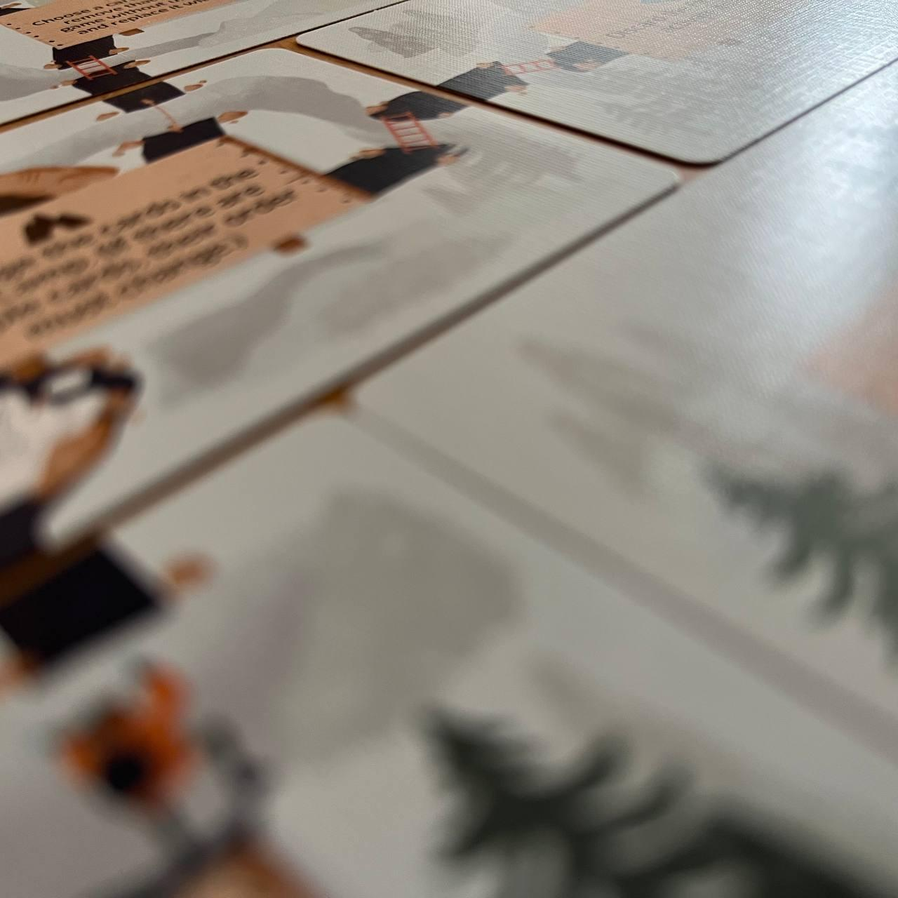
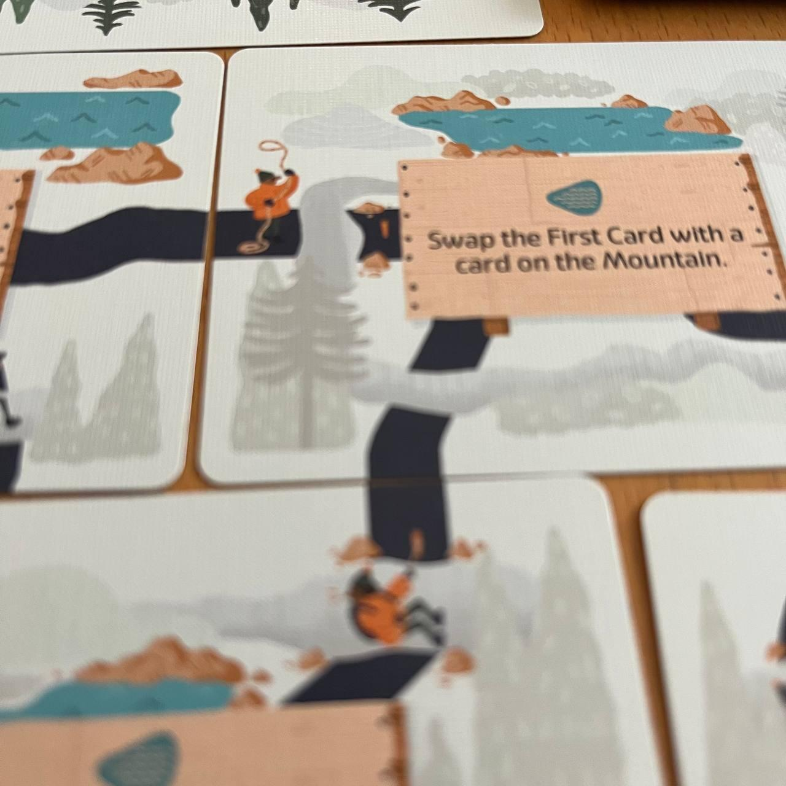
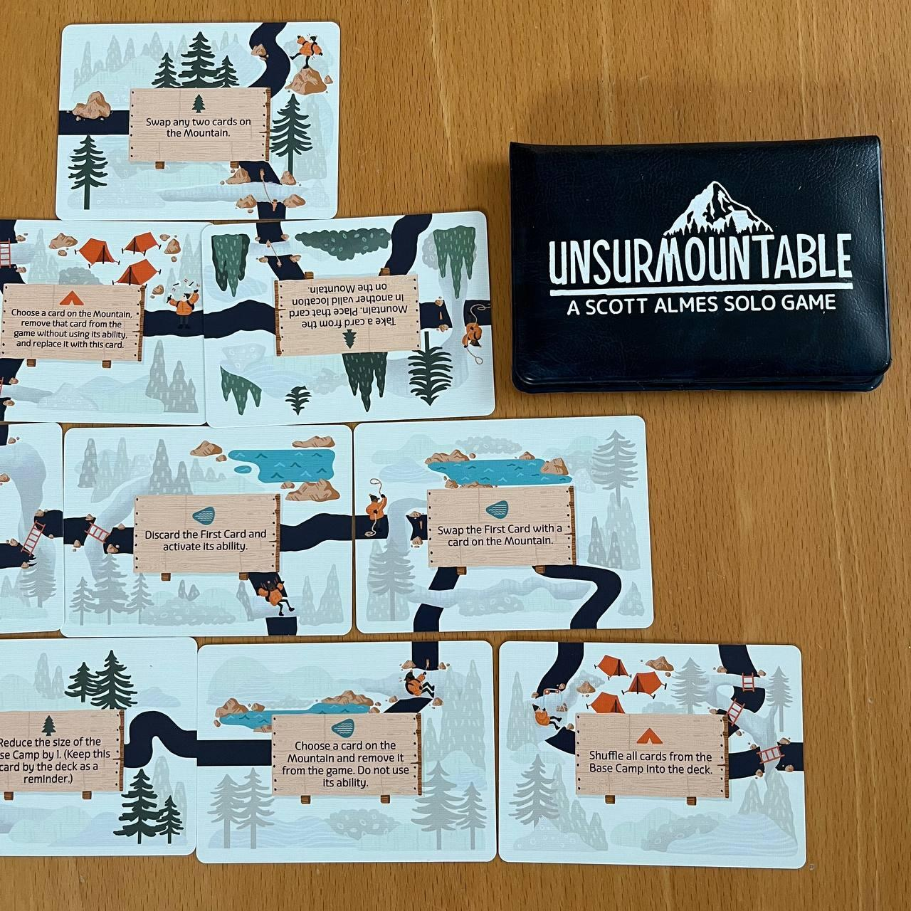

<Setting>

  Sei un alpinista. La strada è più o meno chiara di fronte a te. Partendo dal
  campo base, riuscirai ad arrivare in cima? Oppure le energie ti abbandoneranno
  prima? O - peggio - la strada si <strong>rivelerà un vicolo cieco? </strong>

</Setting>

<Rules>

  Unsurmountable è un gioco in solitaria in cui i round si succedono fino a che
  il giocatore avrà finito il suo mazzo di carte (cosa che determinerà la sua
  sconfitta) o sarà arrivato in cima alla montagna. Durante tutta la partita
  saranno sempre visibili in media 4-5 carte, chiamate il campo base. Durante il
  round si potrà eseguire una di queste due azioni:{" "}
  <ul>
    <li>      <strong> Aggiungere una carta alla montagna:</strong> si prende la carta
      più a sinistra del campo base e la si aggiunge alla montagna, contando che
      si può disporre la carta solamente affianco ad una carta già posizionata e
      solo se si rispetta la struttura 4-3-2-1 della montagna. Non si può
      avanzare ad un livello successivo se non si hanno due carte posizionate
      sotto la carta che si sta disponendo;</li>
    <li>      <strong>Usare una abilità nel campo base:</strong>si scarta una carta
      (tranne la prima a sinistra) e si attiva l'abilità speciale
      corrispondente.</li>
  </ul>
  Alla fine del round si ripristinano le carte nel campo base e si continua fino
  alla vittoria o la sconfitta.

</Rules>

<Feedback>

  Unsurmountable è un gioco che <strong>ha un suo perché</strong>, è inutile
  negarlo.  
  Certamente è un titolo che potrebbe non piacere a tutti, vuoi per la sua forte
  componente aleatoria vuoi per un sistema di gioco che alla lunga può sembrare un
  po’ troppo macchinoso. Insomma, ci sono già abbastanza motivi per non farselo piacere.
  Eppure, grazie ad una durata di gioco molto breve e ad un sistema di difficoltà
  crescente (ci sono 5 livelli di difficoltà che permettono di mitigare sempre di
  più la fortuna che caratterizza questo gioco), Unsurmountable è un gioco che ogni
  amante dei solitari dovrebbe prendere seriamente in considerazione. Non sarà il
  gioco perfetto per tutti i gusti, vuoi per la macchinosità o per l'eccessiva casualità,
  ma saprà regalare grandissime soddisfazioni a chi avrà il coraggio di affrontare
  la scalata.

</Feedback>

