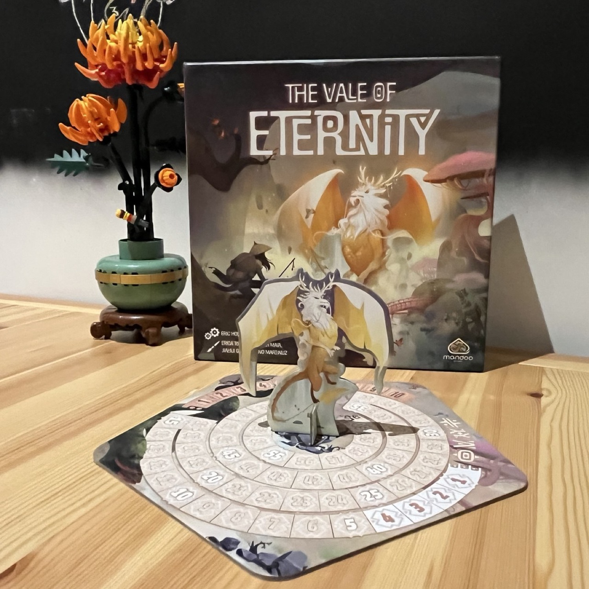
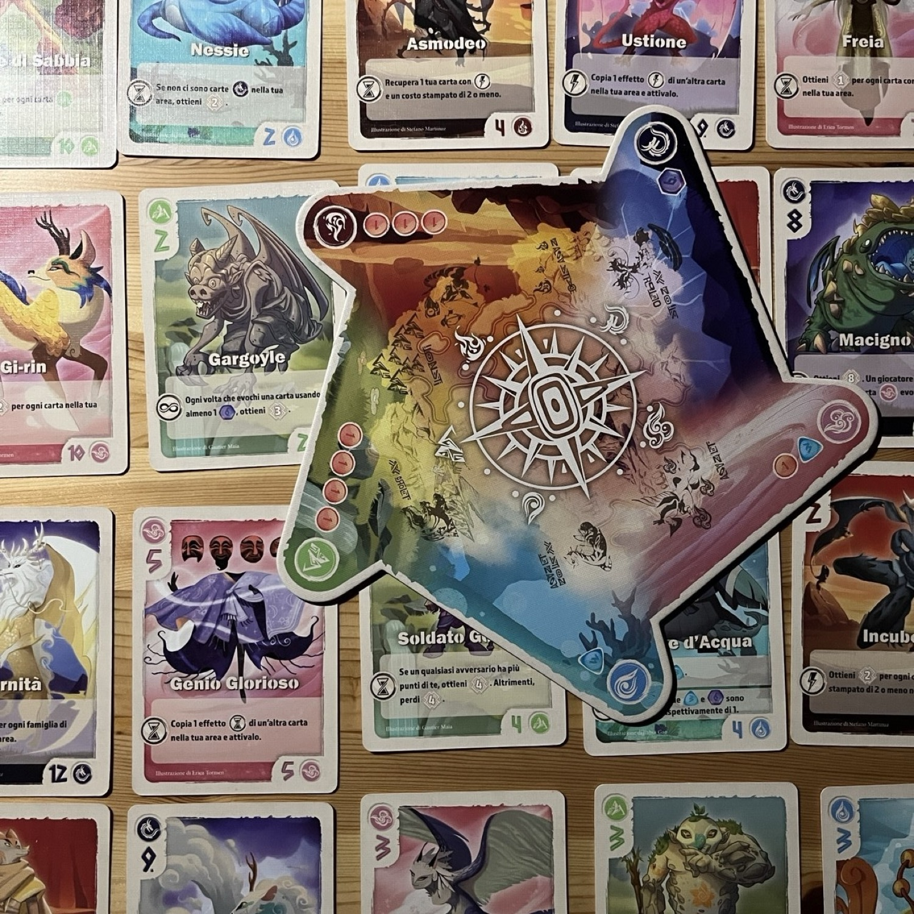

<Setting>
    I giocatori impersonano degli addestratori di potenti creature e spiriti del mondo. Si sa però che il “premio” più ambito altro non è che il potentissimo drago. Fallo entrare nelle tue fila e otterrai riconoscimenti per l’eternità.
</Setting>

<Rules>
    
Il gioco ha una durata massima di dieci round. Ogni round è suddiviso in 3 fasi: <strong>caccia</strong>, <strong>azione</strong> e <strong>risoluzione</strong>.

    
Nella <strong>fase di Caccia</strong> i giocatori dovranno cimentarsi in un draft per scegliere 2 carte mostro. Una volta che ogni giocatore avrà scelto le sue 2 carte si passerà alla fase <strong>Azione</strong>. Durante questa fase il giocatore di turno potrà scegliere cosa fare dei mostri che ha appena scelto: venderli, aggiungerli alla propria mano (domandoli) o evocare uno dei mostri già presenti nella propria mano. Attenzione, però, in Vale of Eternity vendere ed evocare mostri non è così facile! Infatti, per poter evocare un mostro bisognerà pagarne il costo in rune, divise in tipi: rossa (1), blu (3) e viola (6)  le quali, essendo pietre e non “banali” soldi, non possono essere spezzate o ricomposte… per cui scordatevi il resto! Se pagate una carta che costa 3 con una runa viola, l’avete superpagata! Tra l’altro, ne potete avere, salvo effetti speciali, solo 4! L’altro problema riguarda lo spazio: ogni giocatore avrà a disposizione un numero massimo di postazioni per i propri mostri pari al numero del round in corso. Quindi attenti a cosa evocate, perché liberarsi di mostri richiederà una spesa di rune pari al numero del round in corso!

    
Nella <strong>fase Risoluzione</strong>, invece, i giocatori risolveranno gli effetti delle carte mostro con l’icona clessidra. I vari effetti si attiveranno dunque in momenti diversi, a seconda del simbolo: oltre alla sopracitata clessidra, il simbolo dell’infinito indicherà un effetto sempre attivo durante la partita, mentre il fulmine ne indica uno che si attiverà solamente quando il mostro verrà, di fatto, evocato.

    
In generale, gli effetti dei mostri daranno punti vittoria al giocatore, il che è particolarmente importante, considerato il fatto che la partita può finire prima del decimo round, se uno o più giocatori hanno ottenuto almeno 60 punti. In ogni caso, sarà incoronato vincitore il giocatore che avrà ottenuto più punti vittoria.

</Rules>

<Feedback>
    
Tagliamo la testa al drago.

    
Vale of Eternity è un <strong>giocone</strong>. In qualsiasi numero di giocatori la sfida è interessante, anche se con più persone al tavolo si vedranno più carte e quindi più fantacombo e divertimento!

    
Ha lati negativi l’esperienza? Principalmente ne ha uno sul fronte dei materiali e uno su quello del gameplay. Innanzitutto, la plancia in cui si inseriscono le carte per la prima fase di draft (caccia) non è per niente ergonomica. Probabilmente un errore di gestione figlio di un playtesting su TTS? Chi può dirlo! Infatti ci sarà sempre una carta che non si leggerà, rendendo scomoda l’esperienza. Si poteva fare altrimenti! Al momento la soluzione più triste è indubbiamente non usarla come faccio io, ma siamo tutti daccordo che è un peccato vero? Altro punto negativo è sicuramente il fatto che le combo e i motori difficilmente sono fermabili: una volta che un giocatore ha ottenuto i pezzi chiave della sua combo è quasi impossibile da bloccare, se non per i suoi stessi errori o… beh… perché nel frattempo si ottiene una combo ancora più forte!

    
È bene ricordare, infine, che Vale of Eternity è un gioco che diverte, sin dalla prima partita, ma la mole delle possibilità date dalle carte uniche appartenenti a fazioni diverse e con temi differenti crea moltissime opportunità di gioco: solo giocandolo spesso si entrerà davvero nei meandri della sua complessità.

</Feedback>

