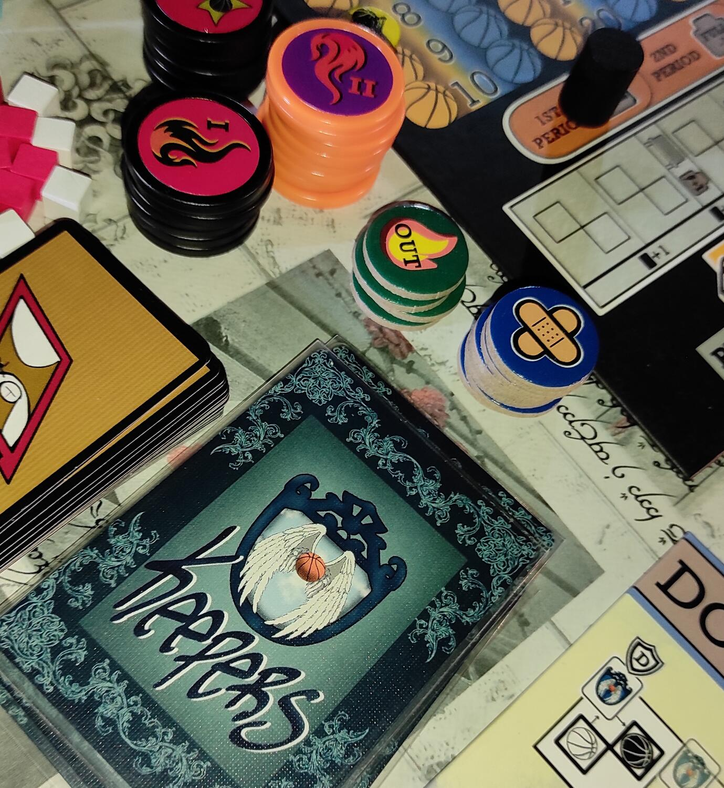
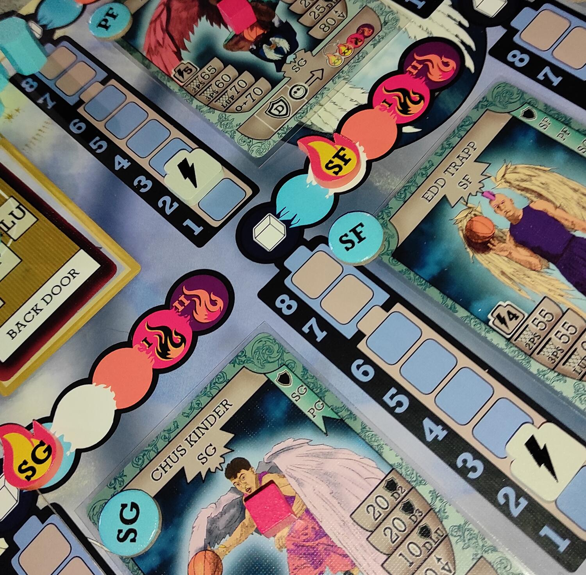
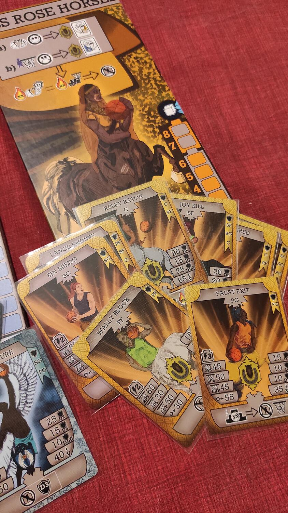

<Setting>

  Siamo su un <strong>campo da basket</strong>! I Centauri dei Keepers si
  sfidano con gli Angeli degli Unleashed. Come allenatori dovrete portare la
  vostra squadra sulla vetta dell'olimpo del <strong>fantasy cestistico</strong>.
  Chi sarà la squadra a fare più canestri e vincere la partita?

</Setting>

<Rules>

  Ogni giocatore avrà una <strong>squadra di 7 Cestisti</strong> da schierare,
  scegliendone tra 10 totali. Ogni cestista ha statistiche e poteri unici da
  utilizzare durante il match.
   
  Prima di iniziare la partita si potrà{" "}
  <strong>personalizzare il proprio mazzo azioni</strong>, il vero cuore del
  gioco, inserendo nelle sleeves protettive delle <strong>carte acetate</strong>
  . Queste ultime possono aggiungere delle azioni, ruoli ulteriori o poteri.
   
  Ad ogni turno l'attaccante potrà giocare carte fino ad occupare i 3 slot a disposizione.
  Le carte sono divise in 4 sezioni, ognuna con un’azione specifica:
   
  <ul>
    <li>      con la <strong>sezione verde </strong>si potranno{" "}
      <strong>effettuare i fondamentali</strong>, necessari per alzare la
      statistica ed avere più chance di andare a canestro; questa tipologia di
      azione segue la "Dinamica della palla", una meccanica che ci obbligherà a
      giocare fondamentali e ruoli specifici nelle carte successive;</li>
    <li>      per <strong>andare a canestro</strong> si userà la{" "}
      <strong>sezione rossa</strong>, con i vari tipi di tiro (layup, da 2 o da
      3 punti); una volta giocate le carte si sommeranno i valori dei
      fondamentali andati a buon fine con la statistica del giocatore coinvolto
      nel tiro; si tira un dado da 20 facce e se il valore raggiunto è uguale o
      minore rispetto al risultato del dado il canestro è fatto; mentre
      l'attaccante giocherà le sue carte, il difensore potrà rispondere per
      cercare di fermare l'azione, giocando a sua volta le carte che ha in mano;</li>
    <li>      la <strong>sezione gialla </strong>della carta (aggiunta con gli acetati)
      permetterà di <strong>fermare i fondamentali dell'attaccante</strong>;</li>
    <li>      con la <strong>sezione Blu</strong>, invece, si andrà in{" "}
      <strong>difesa al tiro</strong>.</li>
  </ul>
  Con queste carte, però, oltre ad avere l'opportunità di fermare l'azione, si
  rischierà di fare <strong>fallo</strong>. Quest'ultimo si risolverà
  utilizzando un dado apposito e in base al risultato ci saranno bonus e malus
  da applicare.
   
  Finita l'azione, con canestro o meno, il difensore del turno precedente
  inizierà il suo attacco e via così per il resto dei turni fino alla fine del
  periodo. Durante il periodo ci sarà modo di pescare altre carte e rigenerare
  energia ai giocatori. Sarà possibile durante l'intera partita chiamare{" "}
  <strong>timeout</strong>, effettuare <strong>sostituzioni</strong>, utilizzare
  le <strong>azioni coach</strong> per chiamare le carte schema (potenti azioni
  indifendibili) <strong>e tanto altro</strong>. 
  <strong>Dopo 4 periodi</strong> il giocatore con più punti vince la partita.

</Rules>

<Feedback>

  Il gioco è <strong>tutto italiano</strong>, sviluppato, disegnato e
  Autoprodotto da Emanuele Gemme e Ilaria Rizzini, con la loro etichetta Pick
  'n' Roll Games Lab. Il <strong>lavoro </strong>svolto è{" "}
  <strong>minuzioso e pazzesco</strong>, che si parli di componentistica o che
  si parli di illustrazioni, bilanciamento e gamedesign.
   
  Mettiamo subito le cose in chiaro: se si è già avvezzi al Basket si è
  leggermente avvantaggiati nell'apprendimento del gioco. Il{" "}
  <strong>regolamento </strong>è <strong>corposo</strong>, con tante regole e
  regolette che potrebbero portare a dimenticarsene qualcuna (come ci è
  successo… spesso). Questo, da un lato, aumenta la sensazione di{" "}
  <strong>simulazione di una vera partita di basket</strong>; dall’altro, spezza
  molto il gioco, facendolo <strong>durare più del previsto</strong>: in tutte
  le partite che abbiamo fatto abbiamo, infatti, oltrepassato di molto il tempo
  indicato sulla scatola.
   
  <strong>Non bastano</strong> sicuramente{" "}
  <strong>un paio di partite per padroneggiarlo</strong>: la costruzione del
  mazzo va leggermente <strong>studiata</strong>; allo stesso modo, la scelta
  dei giocatori, la dinamica della palla, i falli e le reference card sono tutti
  elementi che si amalgamano bene ma possono essere troppi da gestire. Quando si
  è presa dimestichezza, le cose migliorano e il gioco risulta più fluido.
   
  Quanto alle <strong>modalità di gioco</strong>, abbiamo la{" "}
  <strong>partita classica</strong> che può essere giocata in 4, 2 o 1 periodi/o
  (andando così a velocizzare la partita stessa). La{" "}
  <strong>modalità Draft</strong> ci permette di scegliere giocatori di tutte le
  squadre (per ora sono solo due). La <strong>modalità "THE SERIES"</strong>,
  infine, che dà il nome alla scatola, ci permetterà di affrontare una vera e
  propria "Campagna" in una serie di 7 partite. In quest’ultima modalità
  inizieremo con un mazzo e cestisti base che potenzieremo partita dopo partita,
  andando ad aggiungere le Carte acetate che conquisteremo durante il match,
  completando obiettivi e vincendo i vari periodi del game in corso.
   
  Da amante del Basket posso dire che questo <strong>prodotto </strong>è{" "}
  <strong>fatto veramente bene</strong>, possiamo definirlo un gioco di{" "}
  <strong>altissima simulazione della Pallacanestro</strong>, una vera{" "}
  <strong>chicca </strong>per gli appassionati.
   
  Non vediamo l'ora di scoprire le nuove squadre nella prossima scatola, "The
  Dynasty".

</Feedback>

