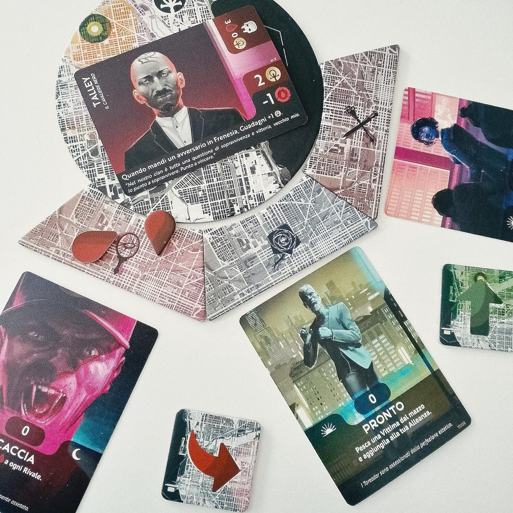
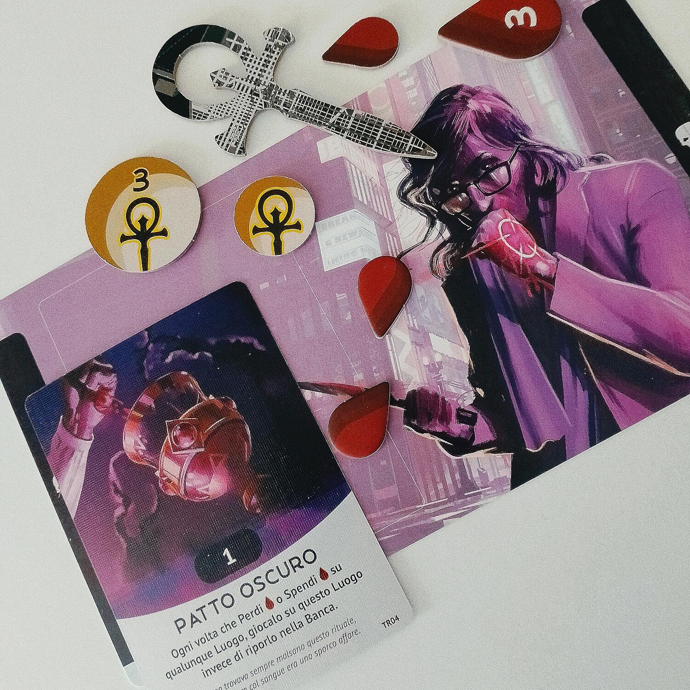

<Setting>

  Dalle atmosfere fumose del celebre GDR, la Masquerade approda su questo gioco
  di carte in cui, nei panni di capoclan di <strong>vampiri</strong>, i
  giocatori si contendono il controllo dei quartieri di Chicago, in una lotta
  diabolica fatta di assalti diretti, giochi di potere e strategie psicologiche.{" "}
  <strong>Scorrerà tanto sangue.</strong>
   

</Setting>

<Rules>

  Una partita a <em>Vampiri: la Masquerade – Vendetta</em> si articola in{" "}
  <strong>3 round</strong>, durante i quali i giocatori si alternano in un{" "}
  <strong>numero crescente di turni</strong> giocando<strong> 1 carta</strong>{" "}
  alla volta su uno dei luoghi-chiave che saranno stati disposti sul tavolo.
   
  Le carte a disposizione del giocatore fanno parte di un piccolo{" "}
  <strong>mazzo precostruito</strong>, diverso per ogni clan, che lui o lei
  riceverà all’inizio della partita insieme ad un ammontare di Sangue e di
  Influenza e ad una carta Alleato di tipo Vittima. Ogni carta del clan ha un
  valore numerico di <strong>Potere </strong>che determina la presa del clan sul
  luogo in cui viene giocata. Inoltre, la maggior parte delle carte ha anche un{" "}
  <strong>effetto </strong>che dipenderà dallo stile di gioco del clan.
   
  Il <strong>Sangue </strong>sarà una risorsa preziosa che potrà essere spesa
  per aumentare il proprio Potere in un luogo, ma è allo stesso tempo un
  indicatore di salute: chi rimane a secco, subirà la penalità della Frenesia e
  dovrà uccidere casualmente un suo <strong>Alleato </strong>per succhiarne il
  Sangue. L’<strong>Influenza</strong> determina invece le sorti della partita:
  sono praticamente i punti vittoria che si ottengono in base alla classifica di
  Potere in ciascun luogo.
   
  All’inizio del round, ogni giocatore guadagna il Sangue fornito dagli Alleati.
  Pesca poi le prime 2 carte dal suo mazzo: una la aggiungerà alla propria mano,
  l’altra finirà in fondo al mazzo. Dopo aver giocato le carte (con effetti
  attivi o passivi, scoperte o coperte) nella fase di{" "}
  <strong>Pianificazione</strong>, si procede alla risoluzione del{" "}
  <strong>Conflitto </strong>in ordine crescente di luogo. Ai giocatori è data
  anche la possibilità di ritirarsi dal conflitto e spostare le loro carte sul
  Covo del Principe, l’ultimo luogo. Ad ogni modo, chi partecipa risolve gli
  effetti (in ordine di turno) prima delle carte con il simbolo di Preparazione,
  che di solito mettono a punto le ultime strategie in vista del conflitto; poi
  si stabilisce la classifica del luogo in base al totale di Potere,
  distribuendo l’Influenza e gli Alleati in palio; infine, si risolvono le carte
  con il simbolo di Conseguenze, utili a indebolire i clan per i conflitti
  successivi. Alla fine del conflitto sul Covo del Principe, il clan che ne ha
  vinto il controllo ottiene il Segnalino Primo Giocatore; poi tutti i giocatori
  riprendono in mano le carte giocate durante il round.
   
  Alla fine del terzo round, il clan con più Influenza regnerà incontrastato
  (almeno per ora) su Chicago!
   

</Rules>

<Feedback>

  <em>Vendetta </em>è un gioco che{" "}
  <strong>rapisce sin dalla prima partita</strong>, complice un{" "}
  <strong>comparto artistico davvero superbo</strong> che, insieme alla
  definizione delle meccaniche e dei testi delle carte, riesce a creare
  un’ambientazione che <strong>immersiva </strong>è dire poco. Si entra subito
  in contatto con lo spirito del proprio clan, imparando a conoscerne i punti di
  forza e le debolezze.
   
  La <strong>struttura del conflitto è progettata a regola d’arte</strong>. La
  pianificazione delle mosse all’inizio è più simile ad un procedere a tentoni,
  perché è impossibile prevedere quali carte giocheranno gli avversari, ma già
  dal secondo round si riesce ad anticipare uno schema generale, e a quel punto
  sarà necessario non essere troppo banali nelle proprie decisioni, o si rischia
  di venire intercettati. <strong>La tensione è sempre palpabile</strong>. 
  Più che vero e proprio bluff (perché spesso le risorse a propria disposizione sono
  strette per potersi permettere di giocare al rialzo), la parola-chiave è <strong>    recovery</strong>: <em>Vendetta </em>spinge i giocatori ad approntare strategie aperte
  a tante variabili, che possano essere modificate in corso d’opera in base alle
  risposte degli avversari. Se gli ultimi giocatori si allontanano dalla possibilità
  di dettare il momentum del conflitto e di vincere gli spareggi (che sono frequenti
  e determinati dall’ordine di turno), hanno però il prezioso vantaggio di poter
  giocare quando le principali incognite sono state già svelate.
   
  <strong>L’esperienza ripaga tantissimo</strong>: conoscere lo stile di gioco di
  un clan, che sia il proprio o di un avversario, serve a sapere come questo si comporterà
  in un determinato player count o contro un altro clan in gioco. E naturalmente
  tali informazioni sono quasi fondamentali per la scelta delle carte che andranno
  a comporre la mano.
   
  <strong>Ottima </strong>è anche la <strong>longevità</strong>: i clan sono 7, ma
  le carte che vengono effettivamente utilizzate cambiano di partita in partita,
  come innumerevoli sono le combinazioni di clan che vengono a scontrarsi. Aiutano
  anche due mini-espansioni presenti nel gioco base che danno quel tocco di complessità
  e varietà aggiuntive.
   
  Com’è ovvio, il gioco ha anche dei <strong>difetti</strong>. Perlopiù si tratta
  di piccolezze, come l’ostacolo iniziale di un regolamento (per forza di cose) complesso
  e una certa fertilità per la paralisi d’analisi. Ma naturalmente "l’elefante nella
  stanza", che a volte rovina intere partite sin dai primi turni, è il <strong>    bilanciamento dei clan</strong>. Avere mazzi già costruiti, per quanto scrupolosa possa essere la gestione
  della mano, comporta il rischio di esiti predeterminati perché ci sono strategie
  che obiettivamente sono migliori di altre in date condizioni (anche molte, in alcuni
  casi) che non dipendono dalla bravura dei giocatori. Questo non impedisce di apprezzare
  il gioco, ma può <strong>raffreddare l’entusiasmo</strong>. 
  In conclusione, *Vampire: la Masquerade – Vendetta* è un titolo{" "}
  <strong>accattivante</strong> che porterà via diverse sessioni di gioco,
  piuttosto accessibile a livello di prezzo come di apprendimento, e valido
  anche ad alti player count. Da giocare in 3 o massimo 4 se vi piace il freddo
  calcolo, in 5 (e si può stressare fino a 6) per spargimenti di sangue
  all’insegna della crudeltà gratuita. Ce n’è davvero per tutti!
   

</Feedback>

