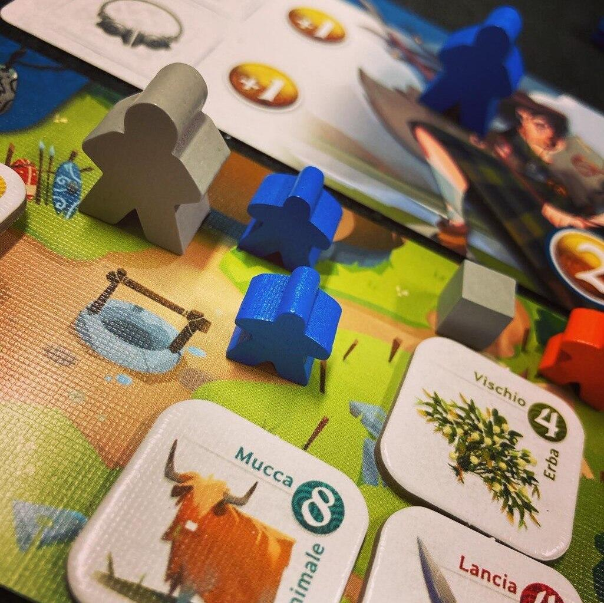
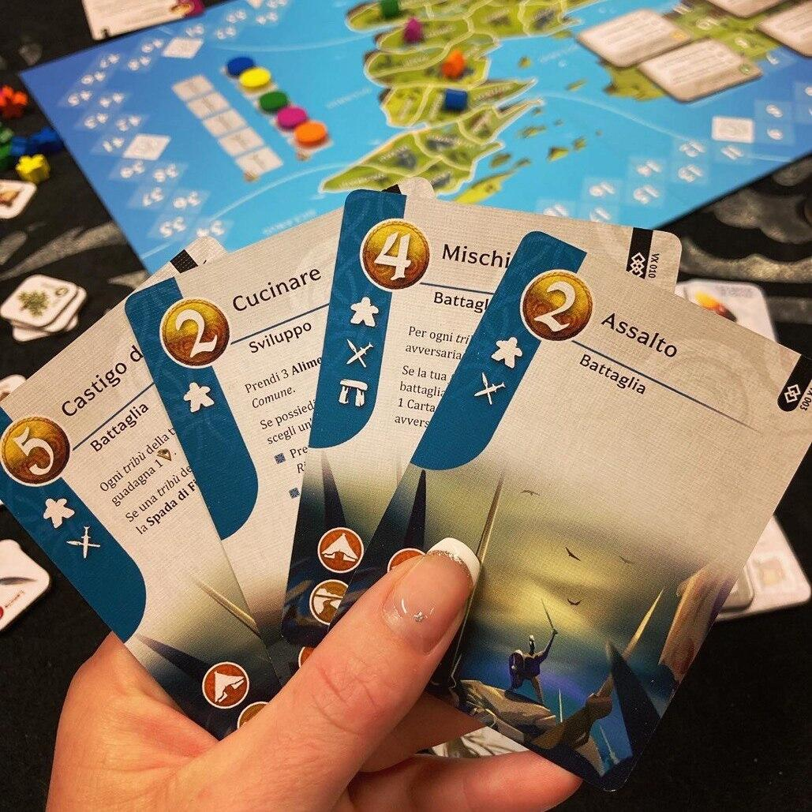

<Setting>

  Britannia 54 a.C.
   
  L'invasione romana è ancora lontana e gli unici a dominare su questa terra
  sono i Celti.
   
  Uniti dalle origini etniche e culturali, dalla condivisione di uno stesso
  linguaggio e dalla medesima religione, rimasero politicamente frazionati in
  tribù distinte sempre pronte a spostarsi. Questo popolo è spesso descritto
  come valoroso e litigioso poiché praticava di norma la caccia e il saccheggio;
  ma, quando non erano impegnati nel combattimento o nella ricerca di un nuovo
  posto in cui insediarsi, i Celti si dimostravano abili commercianti e
  artigiani e spiccavano soprattutto nell'arte dell'oreficeria.

</Setting>

<Rules>

  Gioco strategico asimmetrico tra fazioni durante il quale sarà essenziale
  commerciare, razziare e combattere.
   
  A sfidarsi saranno cinque tribù: Guerrieri, Razziatori, Mistici, Mercanti e
  Artigiani; ognuna disporrà di componenti comuni a tutte, come il set di meeple
  e le carte Villaggio e In Viaggio, più un mazzo personalizzato comprendente la
  Carta Abilità propria della fazione.
   
  Il round si sviluppa su quattro fasi:

 <strong>FASE DEGLI EVENTI:</strong> I giocatori che ne hanno la possibilità, in ordine di turno, possono spendere tre cubetti Valore Divino per pescare una Carta Evento la quale potrà avere un effetto immediato (da leggere, svolgere e scartare immediatamente) o un effetto ritardato (da tenere - non più di una - nell'area di gioco personale e usare successivamente).
     
       <strong>FASE AZIONI:</strong> Ogni giocatore, in ordine di turno, potrà
      impiegare i meeple a sua disposizione per giocare le Carte Azione del suo
      mazzo, risolvendone gli effetti:
       
      Le carte possono essere di quattro tipologie:
      <ul>
        <li>SVILUPPO: per produrre beni o ottenere Valore Divino</li>
        <li>          COMMERCIO: per scambiare beni e ostaggi con il mercato di Portum Itium o con un altro giocatore.</li>
        <li>          RAZZIA: per saccheggiare la carta Villaggio di un altro giocatore rubandogli beni, trofei o ostaggi.</li>
        <li>          BATTAGLIA: per attaccare un altro giocatore guadagnando Punti Vittoria. A questa azione possono partecipare anche altri giocatori a supporto di chi attacca o di chi difende.</li>
      </ul>
    È molto interessante che le Carte Base siano disponibili fin da subito,
      ma che le Carte Speciali siano attivabili solo dopo averle apprese con la carta
      dedicata; tutte hanno costi differenti e possono essere utilizzate una volta
      per turno.  
      Va inoltre precisato che i beni ottenuti in questa fase verranno
      posizionati dal giocatore sulla sua carta In Viaggio e non potranno essere
      oggetto delle azioni commercio o razzia, che possono avere come bersaglio
      solo i beni presenti sulla carta Villaggio dei giocatori.
  La fase termina quando tutti i giocatori avranno passato e l'ordine in cui lo
  faranno determinerà l'ordine di gioco del turno successivo. Il primo giocatore
  a passare otterrà un punto Vittoria.
     
    <strong>FASE DI RIPRISTINO:</strong> tutti i beni, trofei e ostaggi
      presenti sulle carte In Viaggio vengono spostati sulle rispettive carte
      Villaggio e tutti i meeple tornano disponibili per il turno successivo,
      così come le Carte Azione utilizzate.
  Ogni giocatore può equipaggiare o “disequipaggiare” la sua carta personaggio
  con i beni ottenuti per guadagnare bonus e può usufruire dei benefici della
  Carta Abilità della sua tribù.
   I giocatori infine, ottengono un punto Vittoria per ogni ostaggio, per ogni
  personaggio equipaggiato con una Fibula e se sono in possesso del trofeo Lancia
  di Gorias.
     
  <strong>FASE DELLE FESTIVITÀ:</strong> sul tracciato dei Turni sono
      posizionati quattro tasselli Festività con degli obiettivi comuni che, se
      rispettati, forniscono Punti Vittoria.
  Il gioco termina allo scadere dell'anno ovvero dopo il dodicesimo turno.

</Rules>

<Feedback>

  Già dal setup semplice Verrix è un gioco con tanti dettagli, quindi lunghetto
  da spiegare, e le prime partite possono essere leggermente macchinose, ma, una
  volta interiorizzate le regole, tutto diventa molto più scorrevole. Essendo
  asimmetrico, bisogna prendere confidenza con le abilità della propria tribù e
  conoscere bene il proprio mazzo per impostare al meglio la propria strategia.
  Ogni tribù necessita di ragionamenti strategici completamente differenti e
  sicuramente un giocatore può avere maggiori affinità con una piuttosto che con
  un'altra (aspetto peraltro che può rendere il gioco ancora più avvincente). A
  tal proposito, ad esempio, per far punti non sarebbe strettamente necessario
  razziare e combattere, ma sicuramente per razziatori e combattenti queste
  saranno azioni essenziali per esprimere l'unicità della loro tribù (e anche a
  livello generale è un peccato non sfruttare questi aspetti così
  caratterizzanti del gioco).
   
  Ogni fase e ogni azione sono descritte molto bene, sia nel regolamento che
  sulle carte, quindi non è difficile comprenderne gli effetti e impostare il
  proprio gioco; solo la battaglia appare alquanto confusionaria e, nonostante
  le diverse partite, non è per nulla facile padroneggiarla. L'alternanza dei
  round guidati prima da chi attacca e poi da chi difende, l'uso delle carte e
  dei gettoni Morrigan, i movimenti dei meeple sulla plancia che dipendono dalla
  loro entità… Sono davvero tanti elementi che non appaiono così chiari alla
  prima lettura del regolamento.
   
  Detto ciò, Verrix è un gioco che conquista fin dalla prima partita,
  sicuramente grazie anche alla fortissima e adorabile ambientazione. La sua
  bellezza risiede proprio nell'immediata percezione della passione degli autori
  per i Celti: ogni singolo aspetto è storicamente e culturalmente accurato,
  ogni nome, ogni abilità, ogni evento, tutto è collegato a usanze e culti
  celtici. Il giocatore viene così catapultato in un'altra epoca e questo
  contribuisce alla sua immedesimazione nel personaggio. Pertanto, anche chi non
  ama gli strategici commetterebbe un grave errore di giudizio ritenendo che
  Verrix non possa fare per lui.
   
  Il gioco dà il suo meglio in quattro o cinque partecipanti, perché così si può
  percepire a pieno il fastidio che le tribù celtiche si procuravano l'una
  all'altra nell'antichità per prestigio, ricchezze e potere. In tre o in due,
  invece, questo aspetto è quasi totalmente assente, perché senza
  l'imprevedibilità data dalla presenza di più fazioni il gioco può diventare
  leggermente più noioso.

</Feedback>

