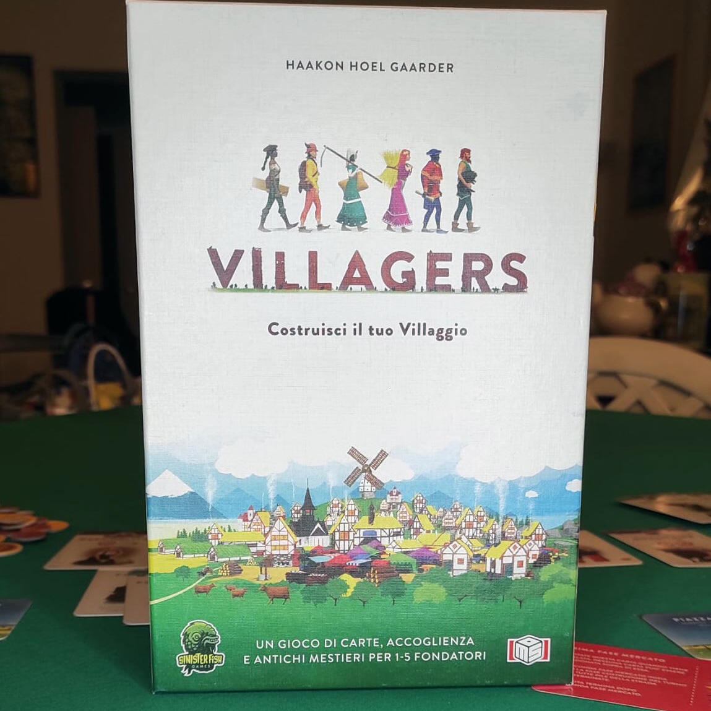
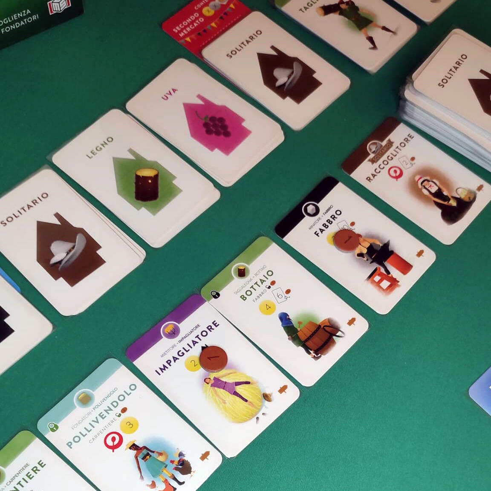
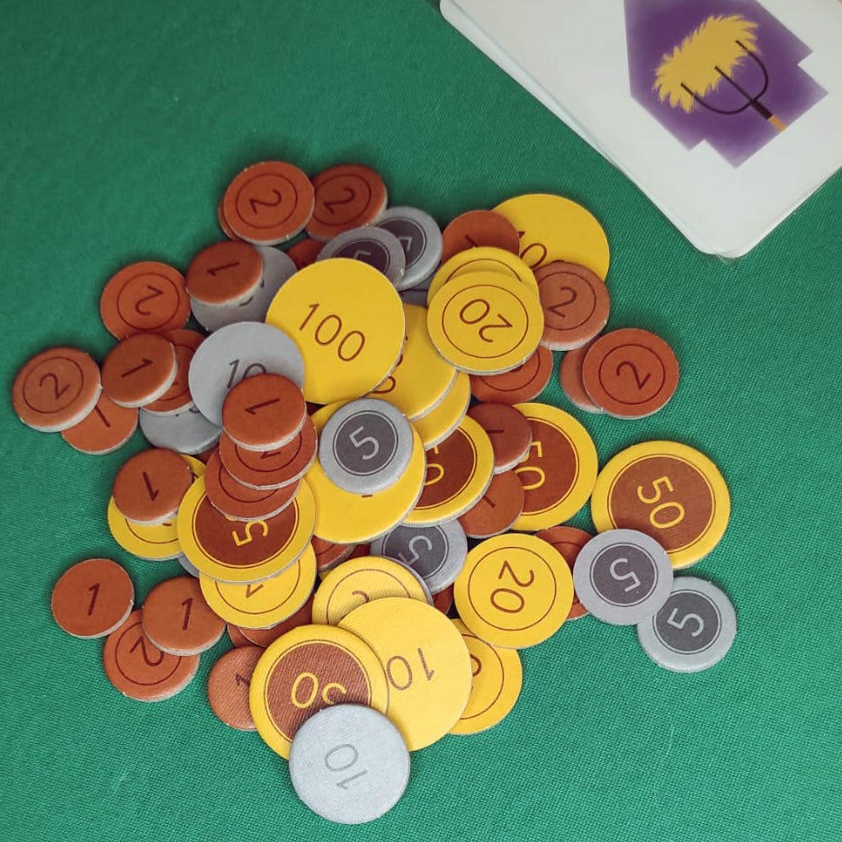

<Setting>

  Medioevo, la peste è ormai debellata. Come fondatori sarete chiamati a
  ricostruire il vostro villaggio e ad accogliere rifugiati in cerca di un nuovo
  inizio. Ogni artigiano ha delle qualità che andranno in sinergia con quelle
  degli altri paesani. Sta a voi cercare di rendere il villaggio un posto
  confortevole e garantire grossi profitti. Chi costruirà il villaggio più
  prospero?

</Setting>

<Rules>

  Si prepara la strada formata da due file di carte: nella fila bassa i 6
  Paesani iniziali, nella fila alta 6 pile coperte, con un numero di carte pari
  al doppio dei giocatori. Sotto la seconda e la sesta pila si inseriscono le
  carte primo e secondo Mercato. Completano il setup i Peasani base (Minatore,
  Taglialegna, Mietitore) e il mazzo dei Paesani.
   
  Ogni giocatore riceve 5 carte, 8 monete e una carta Fondatori. Ogni carta
  appartiene a una tipologia, su cui sono riportati mestieri e simboli.
   
  Il gioco si svolge in due fasi:
   
  <strong>Acquisizione:</strong> A turno si scelgono carte dalla Strada. Il
  limite di acquisizione è di 2 carte, che può aumentare se nel villaggio sono
  presenti Paesani con il simbolo cibo (massimo 5). Le carte scelte vengono
  rimpiazzate dalle pile superiori. Alla fine della fase, si scartano i Paesani
  rimasti e si ripristina la fila.
   
  <strong>Costruzione:</strong> Utilizzate le carte per costruire il Villaggio.
  Avete un limite di 2 carte, che potete aumentare con i simboli casa già
  presenti nel Villaggio.
   
  Per essere costruite, le carte hanno quasi sempre bisogno dei Paesani base,
  che rappresentano l’inizio di una catena di produzione e possono avere fino a
  due ramificazioni di Artigiani.&nbsp;
   
  Il gioco termina quando viene pescata l'ultima carta della sesta pila. Quindi
  si scoprono le carte Mercato e si effettuano dei conteggi:&nbsp;
   
  Al primo Mercato guadagnerete monete in base ai valori dei simboli oro e alle
  monete presenti sulle carte. Nel secondo Mercato si riconteggeranno i
  precedenti più i simboli argento.
   
  Chi ha più monete vincerà la partita.

</Rules>

<Feedback>

  Villagers è un gioco di carte con <Link to="/mechanisms/drafting">draft</Link>{" "}
  e <Link to="/mechanisms/gestione-mano">gestione mano</Link>, nato da un
  Kickstarter di notevole successo. Risulta facile da intavolare e buono per
  introdurre nuovi giocatori. Il regolamento è preciso, con vari esempi e
  illustrazioni. Componentistica di media fattura: le carte sono gradevolmente
  illustrate e l'iconografia è chiara; le monete sono di semplice cartoncino. La
  scatola della versione Kickstarter è più accattivante con divisori per carte e
  monete. Nella versione italiana, se volete imbustare le carte, siete al limite
  nel chiudere la scatola.
   
  Il gioco comprende anche una modalità in{" "}
  <Link to="/mechanisms/solitario">solitario</Link> in cui si affronterà "La
  Contessa" con le sue carte Evento (inverno ed estate) che metterà a dura prova
  la costruzione del vostro Villaggio.
   
  Di recente è uscita anche un'espansione chiamata Shifting Seasons che aggiunge
  nuovi paesani, eventi e tipologie di carte. Speriamo che Ms Edizioni riesca a
  portarla in italia.
   
  Anche se è solo un gioco di carte senza particolari fronzoli, Villagers
  risulta essere strategico e profondo al punto giusto. L'interazione tra i
  giocatori è perlopiù indiretta, e l'alea può penalizzare chi pianifica a lungo
  termine.

</Feedback>

