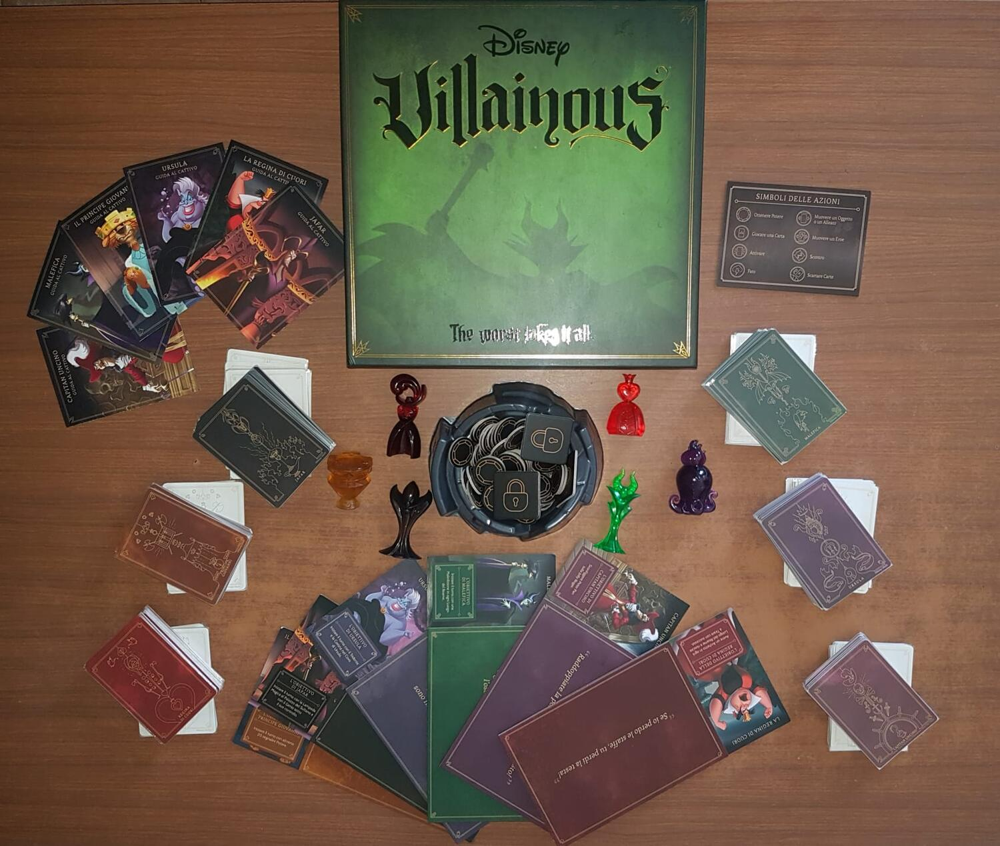
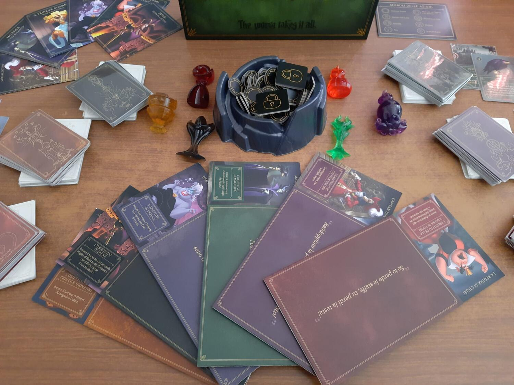

<Setting>

  Nei regni Disney c'è gran fermento: i Cattivi sono tornati! Ognuno vuole la
  sua rivincita, questa volta però non solo contro le loro nemesi eroiche ma
  anche tra di loro. Avventurati nei fantastici mondi di Peter Pan, La bella
  addormentata, Aladdin e tanti altri per scoprire chi sarà incoronato unico e
  vero Re tra i Cattivi.

</Setting>

<Rules>

  Diventa un cattivo Disney! Ogni giocatore per vincere dovrà cercare di
  completare l'obiettivo del proprio personaggio. Ogni cattivo ha delle
  caratteristiche e abilità, che permetteranno di elaborare strategie sempre
  diverse per poter raggiungere la vittoria. Fai attenzione però agli altri
  giocatori! Attraverso delle carte speciali potranno rallentarti e rovinare i
  tuoi piani.
   
  Nella versione base ci saranno 6 personaggi; ognuno di essi avrà:
  <ul>
    <li>      Una plancia di gioco, divisa in 4 aree del regno, sulla quale potranno
      essere svolte diverse azioni di gioco. Si potrà scartare, giocare carte,
      fare un “fato” ai propri avversari, oppure guadagnare segnalini potere.</li>
    <li>      Un mazzo personaggio, composto da carte che ti aiuteranno, attraverso
      oggetti e alleati legati alla storia del cattivo giocato, a raggiungere il
      tuo obiettivo. Ogni carta avrà un costo in segnalini potere da pagare.</li>
    <li>      Un mazzo “fato”, composto dagli eroi della storia del cattivo in
      questione, che potrà essere giocato dai tuoi avversari per danneggiarti e
      rallentarti.</li>
  </ul>
  In ogni turno il giocatore ha 4 carte in mano. Dovrà scegliere dove muoversi
  sulla propria plancia e potrà svolgere le differenti azioni presenti in
  quell'area. Alla fine del turno il giocatore deve pescare dal proprio mazzo
  fino ad arrivare di nuovo 4 carte in mano.

</Rules>

<Feedback>

  Villainous è un gioco da tavolo molto coinvolgente, che ti permette di passare
  una serata divertente tra amici e rivivere i classici Disney, questa volta nei
  panni dei cattivi.
   
  Il regolamento non è immediato, ma già dopo le prime partite diventa facile
  giocare e si riescono ad elaborare strategie differenti per rendere ogni
  partita diversa dalla precedente. È da tener presente la componente della
  fortuna, perché tutto dipende dalle carte che saranno pescate. L'interazione
  non è ai massimi livelli, anche se con le carte "fato" avremo comunque la
  possibilità di ostacolare i nostri avversari.
   
  La presenza di tanti personaggi tutti diversi, grazie anche alle espansioni
  che possono essere aggiunte al gioco base, permette di aumentare notevolmente
  la rigiocabilità e la longevità del titolo. Tuttavia, proprio a causa della
  grande quantità di personaggi giocabili e della loro asimmetria, sono presenti
  numerosi sbilanciamenti tra alcuni di loro, cosa che può risultare frustante.
   
  Villainous risulta comunque un bel gioco, con componenti davvero eccezionali;
  un must have per gli amanti del mondo Disney ma anche un buon gioco per
  giocatori da tavolo pronti a chiudere un occhio su alcuni dei suoi difetti.

</Feedback>

