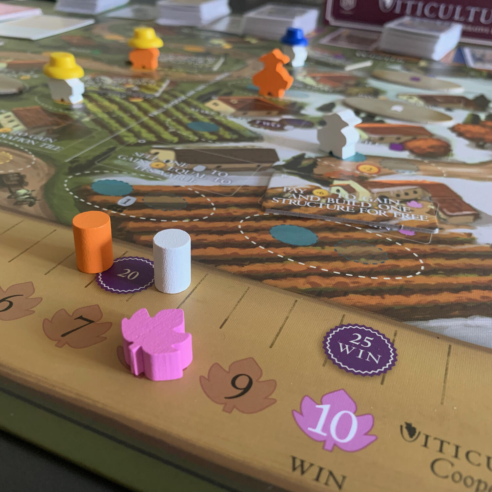
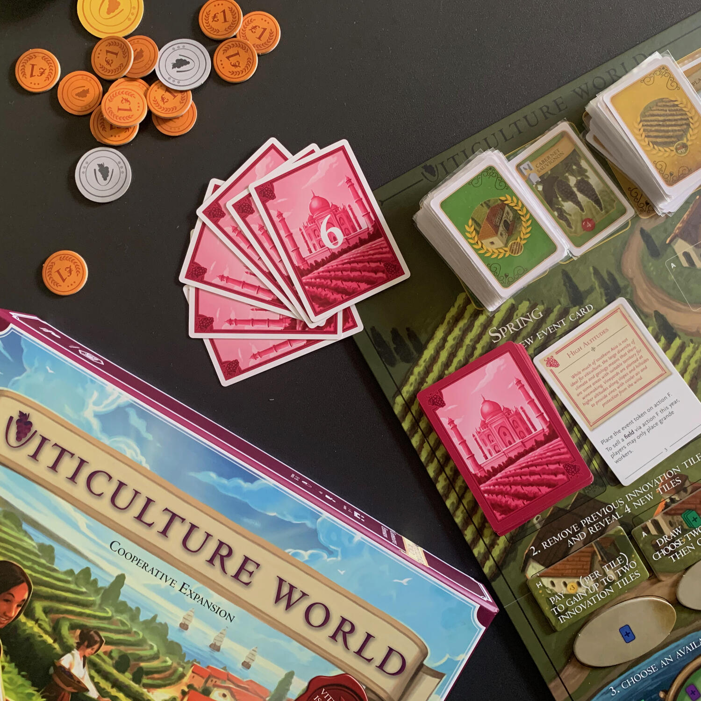
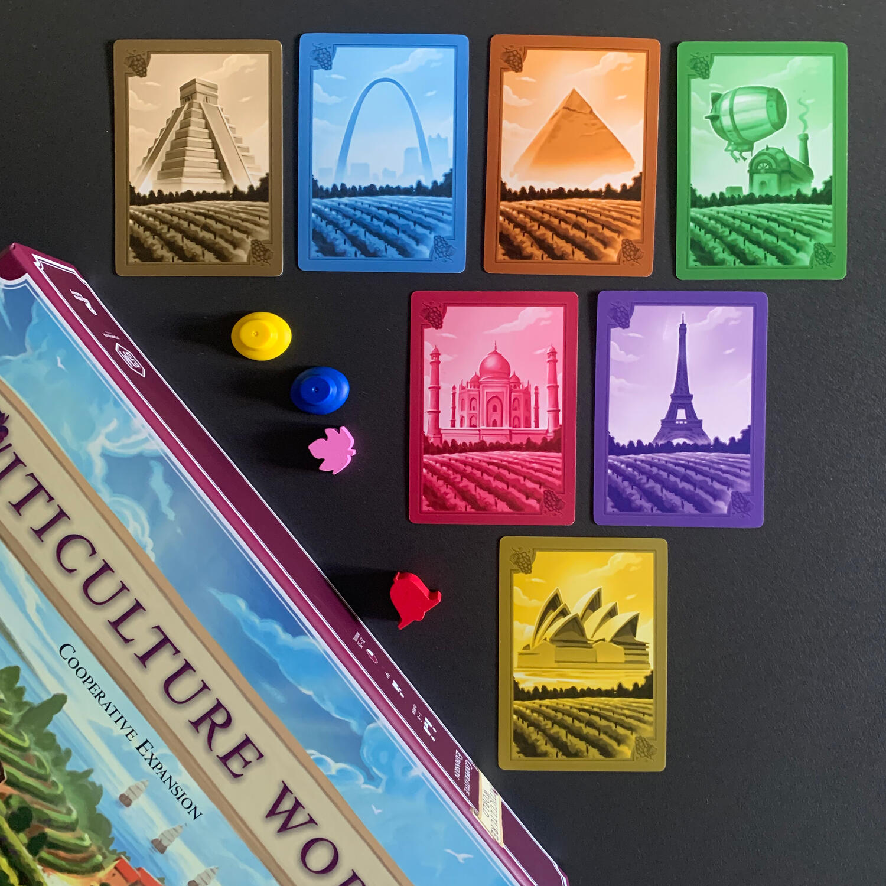

<OriginalReviewLink slug="viticulture" />

<Panoramic>

  Prendete il famosissimo <strong>Viticulture</strong>, smettetela di competere
  e iniziate a <strong>cooperare</strong>, limitate i round a 6, aggiungete una
  spolverata di requisiti da soddisfare a fine partita ed avrete Viticulture
  World!
   
  <strong>Le meccaniche di base sono sempre le stesse</strong>: piantate viti,
  raccogliete uva, fate il vino, completate ordini, migliorate il vostro campo
  con le solite strutture ed accogliete visitatori per poter sfruttare i loro
  super poteri!  
  MA… <strong>tutto cambia</strong>.  
  Il gioco diventa cooperativo, con tutto ciò che questo comporta:{" "}
  <strong>scambiatevi uva, vino, carte</strong>; mettetevi d'accordo su chi
  svolgerà l'azione e chi dovrà sacrificarsi e aspettare l'anno successivo per
  poterla fare; lavorate insieme per vincere insieme.
   I vostri <strong>4 lavoratori</strong> (uno sta nella scatola) entrano <strong>    tutti in gioco</strong> sin da subito, ma <strong>indossando un cappello</strong>: quello giallo
  per i meeple che utilizzerete obbligatoriamente in estate, quello blu per i meeple
  che non temono il freddo. L'azione che prima permetteva di acquisire nuovi lavoratori
  ora rimuove i cappelli, creando così lavoratori più versatili.  
  <strong>Le azioni</strong> sulla plancia sono più o meno quelle a cui ci aveva
  abituato il gioco del 2013, ma con dei{" "}
  <strong>meccanismi per migliorarle</strong>, ovviamente in cambio di un'azione
  e di soldi… che come sapete non sono mai abbastanza.  
  <strong>I 6 “anni” di gioco saranno scanditi dalle carte continente</strong>. Questo
  è il vero motivo per cui vale la pena di provare questo gioco: ogni continente,
  oltre a spiegare come e quando il vino è stato "scoperto" nelle relative zone,
  vi farà affrontare una partita totalmente diversa dalla altre, alcune con obiettivi
  personali, altre con azioni extra che otterrete se farete qualcosa duranta la partita,
  e molto molto ancora (no spoiler).  
  Per vincere la partita, nel limite dei 6 anni,{" "}
  <strong>    ogni giocatore deve raggiungere i 25 punti e tutti insieme devono
    raccogliere 10 punti influenza</strong>
  . E no, non è per niente facile.

</Panoramic>

<Feedback>

  Se nonostante tutti i problemi per cui Viticulture è famoso non vedete l'ora
  di intavolarlo, <strong>se non vi pesa la casualità</strong> dettata dalla
  pesca delle carte visitatore e se i cooperativi vi piacciono da matti, correte
  a comprare questo gioco. Davvero, fatelo.  
  Altrimenti lasciatemi spendere due parole.
   
  Ho comprato Viticulture lo stesso anno in cui è uscito, ci ho giocato davvero tanto
  ma <strong>    non ho mai sopportato il fatto che una singola carta blu potesse stravolgere
    la partita</strong>, nel bene e nel male. Poi è uscito Viticulture World e ho deciso di provarlo:
  mi ha sorpreso.
   
  <strong>    Viticulture World è la versione cooperativa di un gioco che non ne aveva
    bisogno. Ma ora c'è ed è molto bella.</strong> Certo, non è un cooperativo "cooperativo", è più un solitario di gruppo,
  mirato a raggiungere un obiettivo comune.  
  <strong>    Risolve i problemi del base? Assolutamente no, ma li rende più interessanti.</strong>
   
  Quando un giocatore posiziona l'omino grosso dove è già presente un meeple di
  un altro giocatore, può passare carte, soldi e risorse. Questa semplice
  "trovata", unita a una strategia condivisa e lungimirante, può trasformare una
  pesca sfortunata in un sacco di punti vittoria per il collega.  
  Ma quello che davvero mi è piaciuto di Viticulture World sono gli scenari: ognuno,
  diverso dagli altri, spinge a giocare in maniera diversa. Incuriosiscono. Sono
  divisi per livello, da tutorial a difficile, ognuno con un "minigame" all'interno.
  Appena scegliete in che continente giocare, vi verrà spiegato come è nata, in quei
  posti, la passione del vino e vi verranno presentate ulteriori regole che caratterizzeranno
  quella partita (niente di esoterico eh, 5 righe di testo).
   
  Una volta giocato il singolo scenario, potete decidere se passare al prossimo oppure
  se rigiocare lo stesso scegliendo casualmente 6 carte delle 8 disponibili, dando
  vita a nuove tattiche. Certo, saprete già che minigame andrete ad affrontare, ma
  l'ordine di rivelazione degli "eventi" cambierà di molto il gioco.
   
  Un'altra caratteristica interessante è che questa versione cooperativa si può giocare
  con tutte le espansioni esistenti: la plancia di gioco, infatti, ha due lati, una
  normale e una per poterlo giocare con <strong>Tuscany</strong>!  
  Ho preferito World al base? Sì.  
  Comprerei Viticulture e Viticulture World solamente per giocarlo cooperativo? Non
  credo, prenderli entrambi ha un bel costo.
   
  Avete già il base e volete ritirarlo fuori dalla Kallax per utilizzarlo come <strong>    gateway verso giochi più pesanti</strong> con i vostri amici spaventati? Ve lo consiglio.  
  In ogni caso ricordatevi che è illegale giocare a Viticulture senza un calice
  di vino a farvi compagnia!

</Feedback>

