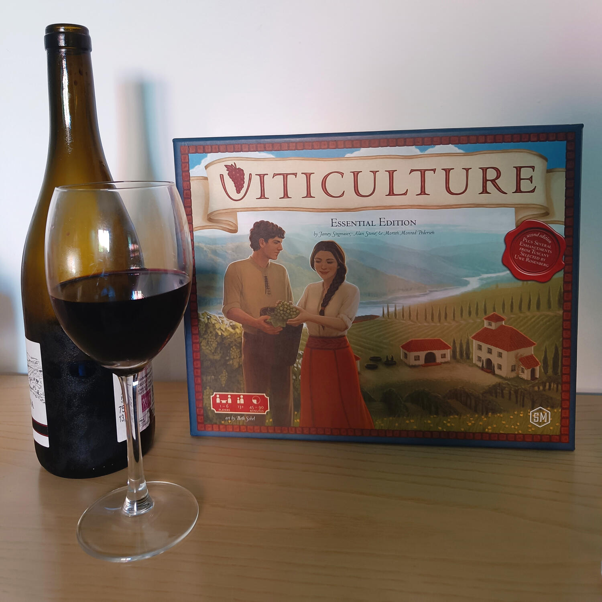

<Setting>

  Immaginate che “Un’ottima annata”,{" "}
  <s>se non sapete di quale film stiamo parlando non siamo più amici</s>{" "}
  (andatelo a guardare) si trasformi in un gioco da tavolo: quello che ne verrà
  fuori sarà Viticulture!
   
  Piccola unica (ma che stiamo dicendo?? ENORME) differenza rispetto al film,
  oltre a non incrociare Marion Cotillard ogni due per tre, è che non siamo in
  Provenza ma in Toscana, pronti per creare la più grande azienda vinicola del
  bel paese. Pianteremo viti, raccoglieremo le uve, imbottiglieremo vini e li
  faremo invecchiare in cantine dalle volte a botte per poi venderli poi ai
  nostri clienti.
   
  Sappiamo che il vino è uno dei piaceri della vita, e per questo cercheremo di
  ignorare che secondo la Stonemaier (casa editrice del gioco) una bottiglia di
  champagne può essere prodotta mescolando due vini rossi e uno bianco
  (evidentemente ci dev’essere stato tanto vino anche sul tavolo degli autori
  durante il processo creativo) e procediamo quindi, con sobrio passo, con le
  regole del gioco.

</Setting>

<Rules>

  Viticulture è un gioco competitivo di piazzamento lavoratori da 2 a 6
  giocatori, dove l’obiettivo è quello di riuscire a fare più punti vittoria dei
  propri avversari.
   
  Per fare questo sarà necessario creare un motore di gioco, attraverso il
  posizionamento dei propri lavoratori: il loro numero iniziale, sempre compreso
  tra 2 e 3, sarà diverso per ciascun giocatore e dipenderà da alcune carte che
  saranno pescate casualmente a inizio partita, le carte “Mama” o “Papa”: queste
  forniranno altre risorse aggiuntive, come strutture o soldi. Ognuno riceverà
  inoltre un singolo lavoratore “grande”.
   
  La partita sarà scandita dallo scorrere degli anni (cioè i turni), a loro
  volta divisi nelle quattro stagioni, durante le quali si svolgeranno azioni
  differenti:
  <ul>
    <li>      <strong>Primavera</strong>: si determina l’ordine di turno durante
      l’annata, decidendo se partire prima oppure successivamente e ricevendo
      così bonus di compensazione man mano crescenti;</li>
    <li>      <strong>Estate</strong>: in questa fase ciascun giocatore deciderà quanti
      lavoratori posizionare, e dove farlo, per svolgere le azioni disponibili,
      che permetteranno di sviluppare la propria vigna, di costruire strutture,
      di accumulare soldi oppure di pescare e/o giocare le carte “ospite estivo”
      (delle carte che forniscono importanti bonus);</li>
    <li>      <strong>Autunno</strong>: in questa fase ognuno pescherà una carta ospite
      estivo oppure una carta ospite invernale;</li>
    <li>      <strong>Inverno</strong>: in questa fase i lavoratori rimasti a
      disposizione potranno essere posizionati per svolgere azioni che diano
      frutto a quanto impostato in estate: raccogliere l’uva, produrre bottiglie
      di vino dalle proprie vendemmie, giocare carte “ospite invernale” e
      soddisfare le ordinazioni, cioè vendere il vino prodotto e accumulare
      punti vittoria.</li>
  </ul>
  Tutta la partita si svolgerà tra una plancia personale, ovvero la propria
  azienda vinicola, dove si pianteranno vigne e costruiranno strutture, e una
  plancia principale, ovvero i campi dove si potranno mandare a lavorare i
  braccianti a disposizione. Gli spazi azione saranno però limitati, e quindi
  l’ordine di turno sarà importante per non ritrovarsi senza la possibilità di
  svolgere quanto desiderato: in questo caso sarà possibile usare l’unico
  lavoratore “grande”, che permetterà di svolgere un’azione anche senza un
  relativo spazio ancora disponibile.
   
  La partita finisce non appena un giocatore raggiunge i 20 punti vittoria: a
  quel punto tutti potranno svolgere le ultime azioni prima della fine
  dell’anno/turno e si conteggerà il punteggio finale.

</Rules>

<Feedback>

  Viticulture si dimostra scorrevole e con una complessità relativamente bassa,
  il che lo rende adatto anche a giocatori non esperti: i turni scorrono in
  maniera veloce (anche se in 6 giocatori l’attesa del proprio round può
  inevitabilmente farsi sentire), e le regole e le azioni disponibili, sebbene
  numerose, sono comunque facili da assimilare.
   
  I materiali, come ben ci ha abituati oramai la Stonemeier, sono ottimi, e la
  simbologia è chiara. La grafica però soffre del tempo trascorso e gli otto
  anni passati dalla pubblicazione di questo gioco si fanno sentire tutti. Anche
  la tematica, sebbene molto gradevole e “bucolica”, presenta delle sbavature
  che ogni tanto emergono, più che in altri giochi (l’uva che invecchia anno
  dopo anno?).
   
  Un difetto risiede forse nella pesca delle carte (che ci forniscono gli
  “ospiti”, le viti e le ordinazioni da soddisfare), che potrebbe determinare
  l’andamento della partita e crea una certa dipendenza dal fattore fortuna.
   
  Inoltre, con un alto numero di giocatori (5 o 6) diviene molto importante
  l’ordine di turno, per cui gli ultimi risultano più svantaggiati degli altri,
  soprattutto dopo metà partita, quando i bonus di compensazione che si possono
  ottenere nella “fase primavera” sono di fatto poco utili.
   
  Ma al di là di tutto ciò, Viticulture resta un buon piazzamento lavoratori di
  peso leggero, che come il “vino della casa” riesce a farsi apprezzare dai più
  e a regalare delle belle ore di gioco.

</Feedback>

