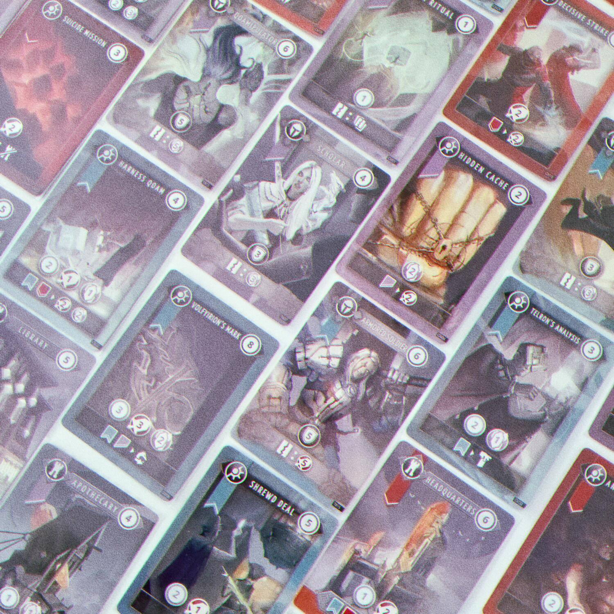
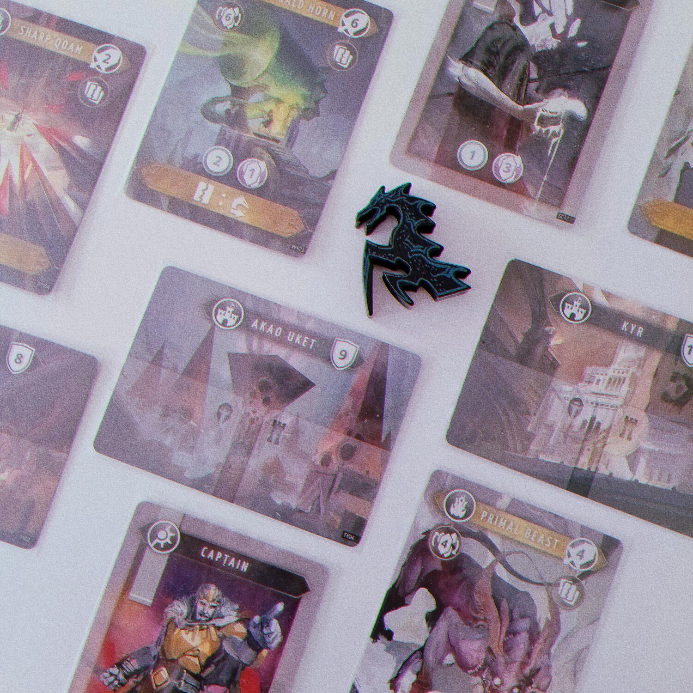
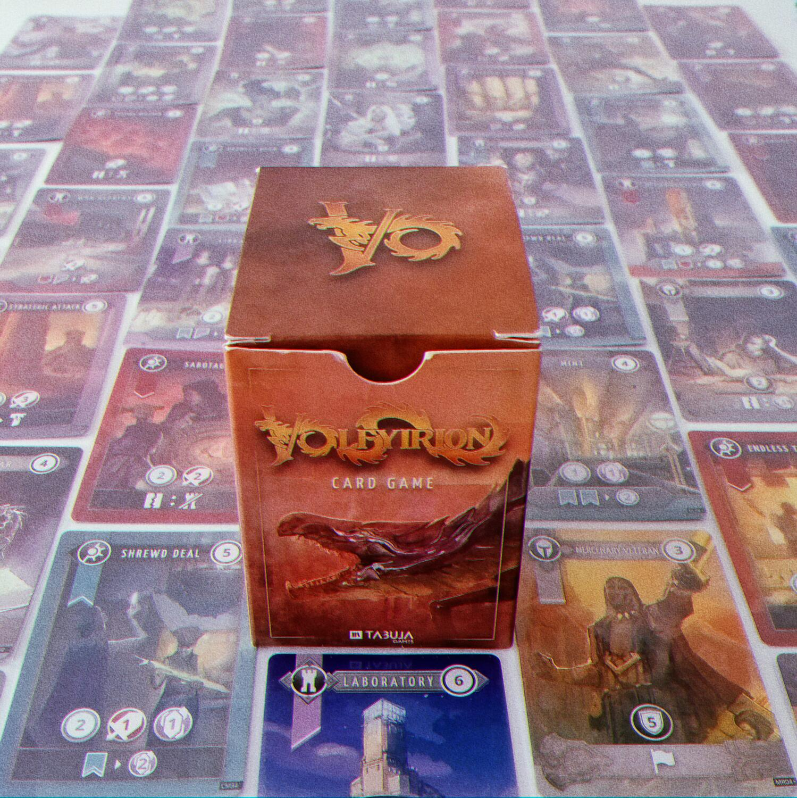

<Setting>

  <em>Volfyirion </em>è uno spin-off di <em>Mysthea </em>(altro titolo di Tabula
  Games) di cui condivide le atmosfere peculiari: un ibrido tra fantasy, cosmic
  horror e bio-punk. Il gioco prende il nome dal <strong>temibile drago</strong>{" "}
  la cui minaccia incombe sulle <strong>due confederazioni di città</strong> in
  lotta tra loro, le quali dovranno gestire nel modo più efficiente le proprie
  risorse per darsi battaglia e allo stesso tempo proteggersi dalla furia di
  Volfyirion.

</Setting>

<Rules>

  Ogni giocatore riceve un mazzetto di 10 carte e un set di 3 carte Città. Al
  centro è posta la carta della Tana di Volfyirion, con la miniatura del drago e
  il Mazzo delle Meraviglie accanto: la Tana ospita sempre le prime 2 carte
  Meraviglia in cima al mazzo. Vengono estratte le prime 5 carte del Mazzo delle
  Strategie, che comporranno il mercato. La partita può cominciare!
   
  Il giocatore di turno pesca le prime <strong>5 carte</strong> del suo mazzo,
  rimescolando gli scarti all’occorrenza. A questo punto può giocare in
  qualsiasi ordine (generalmente tutte insieme) le carte nella propria mano.
  Ciascuna carta ha un <strong>effetto principale</strong>, che fornisce fino a{" "}
  <strong>3 tipi di punti azione</strong> quando viene giocata, e un eventuale{" "}
  <strong>effetto secondario</strong> che invece può essere attivato eliminando
  dal gioco la carta o avendo in gioco carte di colori specifici. I punti azione
  si dividono in:
   
  <ul>
    <li>      <strong>Comando</strong>, per comprare le carte Strategia e aggiungerle ai propri scarti, oppure per spostare una carta Truppa da una delle proprie Città ad un’altra, pagando il costo della carta;</li>
    <li>      <strong>Battaglia</strong>, per comprare le carte Meraviglia e aggiungerle ai propri scarti, pagandone il costo, oppure per attaccare una Città avversaria o la tana di Volfyirion, pagando l’equivalente dei loro punti difesa;</li>
    <li>      <strong>Conoscenza</strong>, per cambiare una carta Strategia nel mercato con la prossima del mazzo, al costo di 2 punti, per bloccare le Meraviglie avversarie o ripristinare le proprie Meraviglie precedentemente bloccate, pagando l’equivalente del loro valore, oppure mandare Volfyirion dalla sua Tana ad una Città avversaria o da una propria Città alla Tana, al costo di 8 punti. Quando un giocatore alla fine del suo turno si ritrova con Volfyirion su una delle sue Città, quella viene automaticamente distrutta.</li>
  </ul>
       
      Una data combinazione di punti, inoltre, può ripristinare una Città
      precedentemente distrutta.
       
      Le <strong>carte Strategia</strong> e le <strong>carte Meraviglia</strong>
      , una volta acquisite, finiscono nello stesso mazzo, ma hanno delle
      differenze sostanziali. Le Strategie si dividono in:
    <ul>
    <li>      <strong>Comandi</strong>, che vengono scartati alla fine del turno;</li>
    <li>      <strong>Truppe</strong>, che vanno assegnate alle Città, rimanendo in gioco tra i turni, e garantiscono loro dei punti difesa aggiuntivi;</li>
        <li>      <strong>Edifici</strong>, che vanno assegnati alle Città, rimanendo in gioco tra i turni, e forniscono punti azione.</li>
    </ul>
       
      Le Meraviglie, come le Truppe e gli Edifici, rimangono sempre in gioco ma
      sono indipendenti. Se infatti una Città venisse distrutta, Truppe e
      Edifici ospitati sarebbero eliminati dal gioco. Inoltre, ogni volta che
      una Meraviglia viene acquisita, il giocatore di turno può eliminare dal
      gioco una carta nella sua mano, in gioco o negli scarti. Infine, le
      Meraviglie possono essere bloccate con i punti Conoscenza per annullare
      temporaneamente i loro bonus.
       
      Vince la partita l’ultimo giocatore a rimanere con almeno una Città in
      piedi.

</Rules>

<Feedback>

  <em>Volfyirion </em>è quello che si definisce un{" "}
  <strong>fast-paced deckbuilding</strong>, ossia un{" "}
  <Link to="/mechanisms/deck-building">deck building</Link> in cui i turni si
  alternano veloci, senza una grande elaborazione di effetti o azioni
  secondarie: si spendono i punti per comprare le carte dal mercato centrale e
  potenziare il proprio mazzo e ogni tanto si colpisce l’avversario. Questo
  sottogenere deve i suoi natali a{" "}
  <Link to="/reviews/star-realms"><em>Star Realms</em>  </Link>
  , da cui <em>Volfyirion </em>prende a piene mani diversi dei suoi meccanismi. Dove
  però il suo predecessore utilizzava un sistema di punti azione “assoluto”, cioè
  in cui il tipo di punto aveva un solo possibile impiego e generalmente le scelte
  offerte al giocatore erano limitate alle carte da acquistare, e in cui i punti
  autorità e battaglia scalavano automaticamente sul totale, <em>    Volfyirion{" "}</em>mette in piedi un sistema “relativo” che prevede <strong>    diverse azioni tutte sempre disponibili</strong> al giocatore, purché riesca a pagarne il costo. Di conseguenza, questo
  apre <strong>molte più possibilità di scelta</strong>, in quanto lo stesso ammontare
  di punti può essere utilizzato in modi diversi e il turno del giocatore non è predeterminato
  dalla sua mano di carte, o almeno non in maniera così vincolante come lo era in{" "}
  <em>Star Realms</em>. Di quest’ultimo <em>Volfyirion </em>risolve anche il problema
  dell’affollamento delle carte base nel mazzo, introducendo le <strong>    Meraviglie{" "}</strong>che ne permettono la costante eliminazione. Questi ed altri sono espedienti
  semplici ma ingegnosi che garantiscono una <strong>    profondità strategica</strong> e una <strong>smaltatura deterministica</strong> che molti deckbuilding
  non riescono ad avere.
   
  All’atto pratico, <em>Volfyirion </em>si presenta come un gioco essenziale, ma
  presto si dimostra <strong>complesso e rifinito</strong>. I suoi ingranaggi sono
  ben rodati e solo poco alla volta si riesce ad intravederne la struttura interna.
  La vera sfida del gioco sta nel riuscire a visualizzare, a fronte di una somma
  dislocata di numeri, le possibilità accessibili e la loro efficacia sul breve e
  sul lungo termine. La <strong>gestione del tempo e delle risorse</strong> è fondamentale,
  forse il vero ostacolo da superare per poter entrare nel cuore del gioco. <strong>    Anticipare le capacità di ripresa dell'avversario</strong> è la vera chiave per comprendere e apprezzare <em>Volfyirion</em>. 
  Dal punto di vista della produzione, non bisogna farsi ingannare dalla
  scatolina. Un mazzo di carte e una pedina sono più che sufficienti a{" "}
  <em>Volfyirion </em>per costruire una{" "}
  <strong>struttura di gioco solida ed articolata</strong>. E nonostante
  l’indipendenza dal linguaggio, un paio di numeri, un nome e delle
  illustrazioni superbe riescono a trasmettere un’immersione nell’ambientazione
  del gioco che tanti titoloni possono solo sognare.
   
  L’unica smagliatura di <em>Volfyirion</em>, se proprio dovessi trovarne una, è
  la sua <strong>lenta curva di apprendimento</strong>: bisogna fare molte
  partite prima di riuscire a non lasciarsi sopraffare dalla naturale casualità
  delle carte e/o da un avversario più scaltro; e anche la visualizzazione delle
  somme dei punti, che possono essere tanti e variare anche nel corso del turno,
  potrebbe richiedere un po’ di allenamento senza l’aiuto di un supporto
  dedicato (che è stato poi implementato nella riedizione).
   
  In conclusione, <em>Volfyirion</em> è un{" "}
  <strong>    titolo ineccepibile, esteticamente pieno, più che portatile, profondo e
    vario</strong>{" "}
  al punto da non potersene mai davvero stancare. Un acquisto obbligato per
  tutte le coppie di giocatori, che regalerà{" "}
  <strong>    sessioni di gioco avvincenti, piene di tensione e di colpi di scena</strong>
  . Non è mai detta l’ultima parola finché l’ultima Città è ancora in piedi.

</Feedback>

