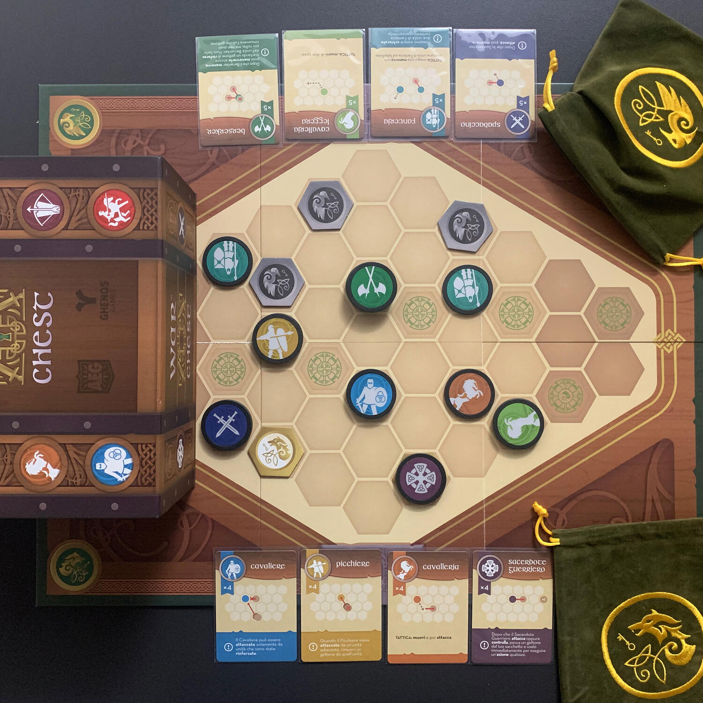
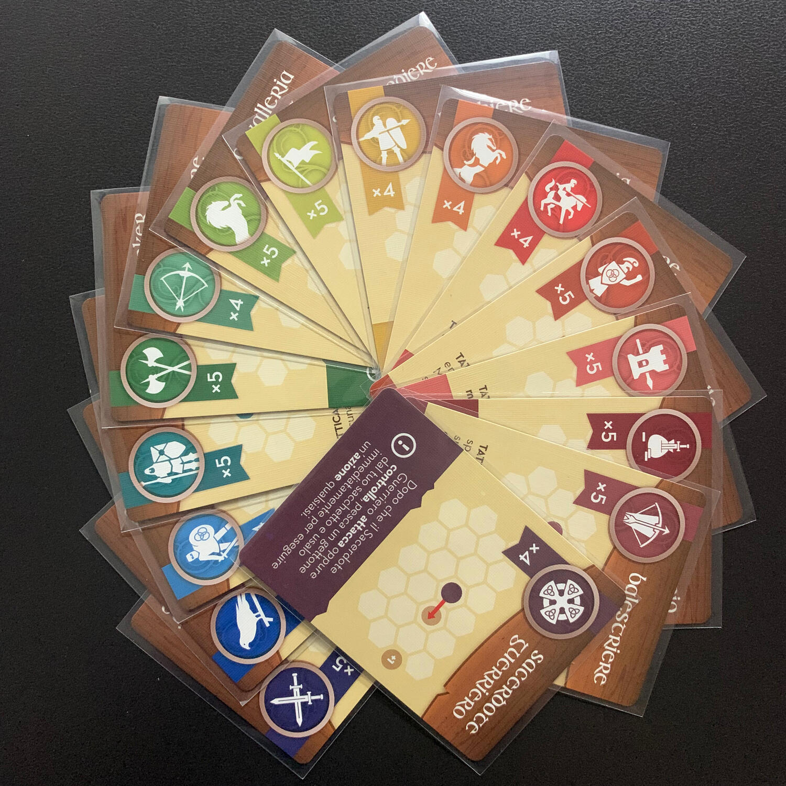

<Setting>

  Ciao, sono Mattia e sono nato negli anni ’90. I pomeriggi, in un semplice paesino rurale del Trentino, venivano spesi
  a giocare con gli amici al parco o al campetto. Nascondino, palla prigioniera, calcio alla "tedesca". E se pioveva si
  giocava con quello che c'era a casa, ovvero dame e scacchi. Ricordo l'edizione De Agostini di{" "}
  <strong>Dragon Ball Z Scacchi</strong>. Fu amore a prima vista: di colpo, un gioco algido con re, regine, alfieri
  diventava subito un combattimento all'ultimo sangue tra Goku e Majin Buu. Il mondo prendeva colore.  
  Passano gli anni, scopri nuovi giochi, ti innamori, ti innamori di nuovo ma il primo amore non lo dimentichi mai… ma poi
  provi War Chest.  
  Mi sento cresciuto per poter bramare una copia di <strong>Dragon Ball Z War Chest</strong>, quindi mi accontenterò di
  questo magnifico gioco dove non sei certo Goku, ma un generale pronto a fare di tutto per portare il proprio esercito
  alla vittoria.

</Setting>

<Rules>

  Premetto che quanto segue sono le regole per la partita <strong>1vs1</strong>.
   
  In una partita a War Chest, il vostro obiettivo sarà quello di conquistare <strong>6 punti di controllo</strong> prima
  dell’avversario.  A inizio partita, ogni giocatore riceverà <strong>4 tipologie di unità militari</strong>, le
  relative carte che ne spiegano il funzionamento e i gettoni corrispondenti; posizionerà poi le carte di fronte a sé e
  riporrà 2 token per ogni unità nel sacchetto, assieme al "gettone reale".
   I gettoni sono una specie di <strong>fiches</strong>, come quelle del poker, dove su un lato è mostrata l'icona dell'unità,
  sull’altro un simbolo neutrale, uguale in tutte.  
  Ogni round è composto di <strong>due fasi</strong>: pescare 3 gettoni unità dal sacchetto e, successivamente,
  giocarli.
   
  Ogni fiche può essere giocata in <strong>9 modi diversi</strong>: 
  <ul>
    <li>      (sulla pancia) <strong>schierare</strong>: se l'unità non è attualmente in campo, può essere "evocata" in un
      vostro punto di controllo;</li>
    <li>      (sulla pancia) <strong>rinforzare</strong>: altrimenti la si può rinforzare posizionando un ulteriore token sopra
      di essa, formando così una pila (l'altezza della pila corrisponde ai punti vita di quella pedina);</li>
    <li>      (scarto coperto) <strong>prendere iniziativa</strong>: diventare il primo giocatore nel prossimo turno;</li>
    <li>      (scarto coperto) <strong>reclutare</strong>: acquistare un ulteriore token unità dalla riserva e posizionarlo
      nell'area di scarto (quando il sacchetto sarà vuoto, questo gettone verrà mescolato assieme agli altri ed entrerà
      a fare parte del nuovo esercito);</li>
    <li>      (scarto coperto) <strong>passare</strong>: …niente;</li>
    <li>      (scarto pubblico) <strong>muovere</strong>: muovere la relativa unità di uno spazio;</li>
    <li>      (scarto pubblico) <strong>controllare</strong>: convertire una posizione neutrale o nemica in propria;</li>
    <li>      (scarto pubblico) <strong>attaccare</strong>: attaccare un nemico adiacente;</li>
    <li>      (scarto pubblico) <strong>tattica</strong>: attivare la tattica specifica della vostra unità.</li>
  </ul>
  Le regole sulle carte, ovviamente, sovrascrivono le regole base; infatti, alcune unità hanno delle limitazioni o delle
  regole aggiuntive per renderle ancora più <strong>asimmetriche</strong>: ad esempio l'arciere deve attaccare a
  distanza due, oppure il cavaliere può essere attaccato solamente da nemici rinforzati.

</Rules>

<Feedback>

  Con War Chest è stato amore a prima vista: come con Goku. È semplice, facile da insegnare, splendido da intavolare e
  un vero e proprio rompicapo. Tutto questo in 30 min a partita.  
  Il <strong>draft iniziale</strong> per scegliere le tipologie di unità è tanto semplice quanto profondo, anche perché è
  ben chiaro che poi quell'esercito ti potrebbe portare tanto alla vittoria quanto alla sconfitta.  
  Nel gioco base, infatti, ci sono <strong>16 tipologie di unità</strong> tra cui scegliere, ognuna con 4-5 token a
  disposizione, tutte fortemente caratterizzate: ci sono quelle da danno corpo a corpo, quelle che attaccano a distanza,
  quelle che puntano più sulla velocità e sull'agilità… Capite bene che bisogna ponderare bene la scelta.
   
  Il gioco gira attorno a due concetti: il <strong>bag building</strong> (la costruzione del sacchetto) e il{" "}
  <strong>bluff</strong>. 
  Quali unità inserire nel sacchetto e quali togliere è la chiave di tutto: è meglio reclutare tutte le unità prima possibile
  per non trovarsi a corto oppure provare a snellire la bag per farla girare meglio e avere certezza della pesca che si farà
  per poter valutare anche il turno successivo?
   
  Tralasciando le unità che l'avversario ha in mano o nel sacchetto, è facile ipotizzare cosa potrebbe avere in mano… no?
  Ed è qui che entra in gioco il bluff. Alcune azioni, infatti, permettono di giocare fiches coperte aggiungendo sempre più
  incognite nel ragionamento (a questo aggiungiamo anche il "gettone reale", un gettone che può essere giocato solamente
  coperto). Ovviamente, questo potrebbe andare a discapito di un movimento o di un attacco, ma si sa che è più importante
  vincere la guerra che una battaglia, no?  
  Se c'è un elemento che odio di War Chest è la <strong>plancia di gioco</strong>: orribile. Ed è per questo che ho già
  provveduto a recuperarmi un playmat che non faccia piangere sangue dagli occhi.  
  Ma il resto è magia.  
  Non vi ho ancora convinti? Provatelo gratis <a href="https://warchestonline.com/" target="_blank">qui</a>!
   
  Alzate le mani al cielo con me: c'è qualcuno che necessità della nostra energia!

</Feedback>

