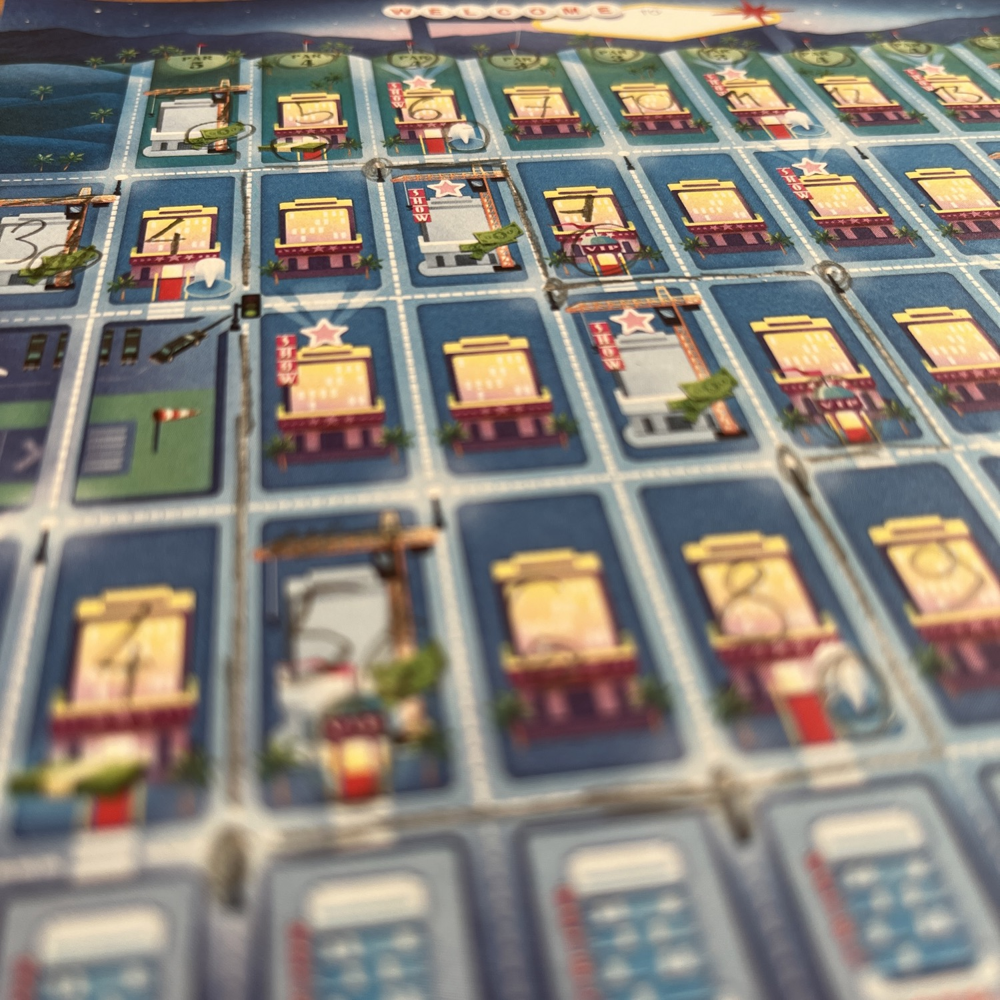
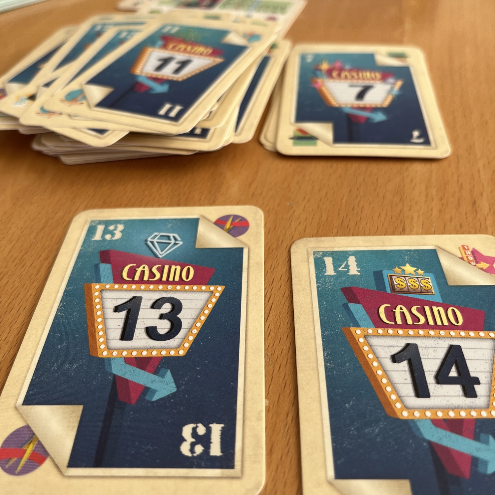
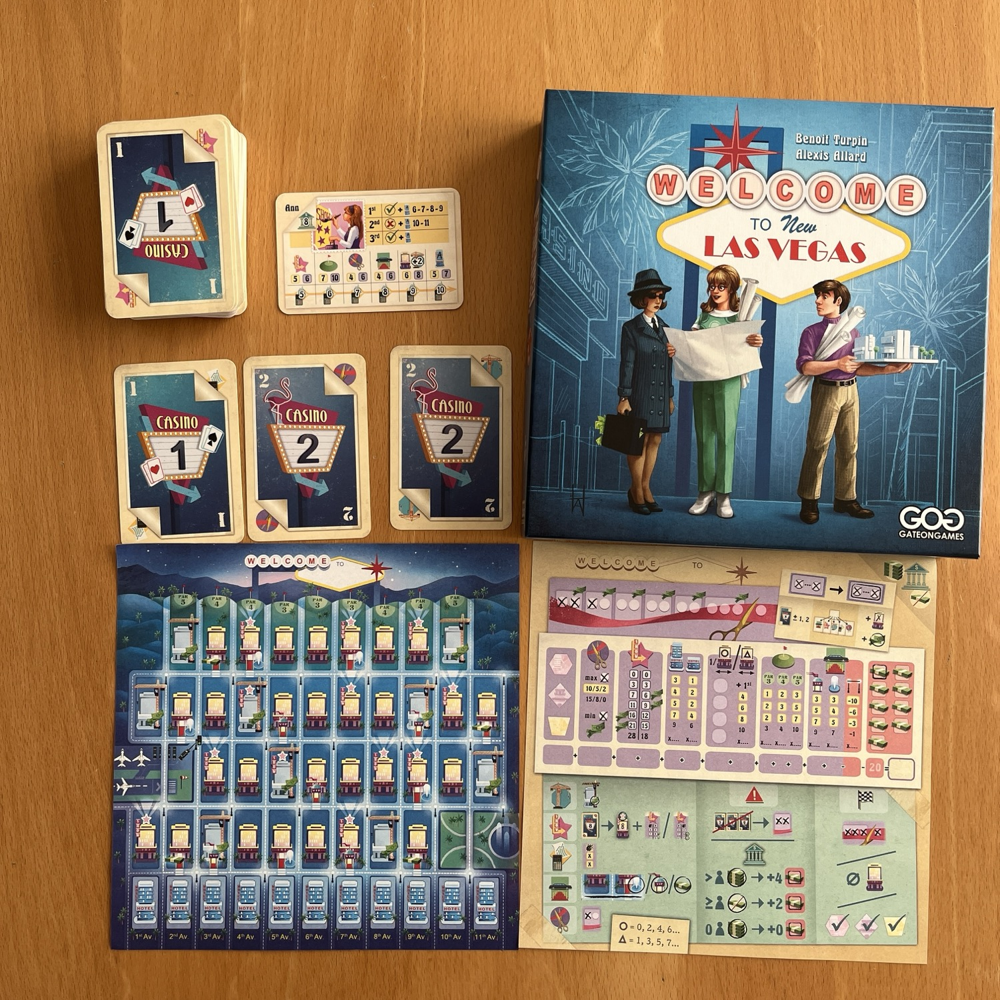

<Setting>

Avete mai sognato di competere con altri architetti per costruire i casinò migliori di una città? Di sistemare i campi da golf in modo che i vostri clienti siano soddisfatti? O i cinema? O gli hotel più rinomati sul percorso della limo? La risposta a queste domande è per caso <strong>sì</strong>?!  
Allora Welcome To New Las Vegas è il gioco perfetto per voi!

</Setting>

<Rules>

"Welcome to New Las Vegas" è un gioco Flip & Write, seguito di Welcome To..., ma questa volta si gioca su due fogli separati. Le carte mostrano numeri che devono essere scritti in ordine crescente da sinistra a destra. Tuttavia, puoi scrivere un numero in qualsiasi momento, rispettando la regola dell'ordine numerico. Ogni carta ha azioni opzionali, come la limousine, che può farti guadagnare punti spostandola davanti a VIP, Fontane o "mafiosi". Ci sono poi i miglioramenti, che ti permettono di aumentare i punti che otterrai, e le costruzioni, che richiedono di investire denaro e indebitarti per completare i casinò.  
Il gioco introduce anche le  <em>Inaugurazioni</em>, che forniscono punti e poteri speciali. Puoi anche partecipare a spettacoli nei casinò, ma attenzione ai debiti. Se non riesci a posizionare un numero, puoi spuntare due  <em>Inaugurazioni</em> senza penalità. A differenza del primo gioco, non si ottengono punti per i blocchi di casinò, ma per bonus come spettacoli, limousine e campi da golf. Il percorso del golf offre punti extra, ma devi costruire un casinò accanto per sfruttarlo appieno. Completa per primo una colonna per ottenere il Grand Hotel, ma gli altri giocatori avranno solo la versione ridotta.   Il gioco termina quando si raggiunge il limite massimo di  <em>Inaugurazioni</em>, non ci sono più numeri da giocare, o si completano tutti e tre i contratti di costruzione e occhio ai debiti! infatti, se avrete dei debiti non pagati a fine partita aspettatevi una decurtazione sul vostro totale di punti!

</Rules>

<Feedback>

Welcome To New Las Vegas è un gioco che saprà appassionare tutti gli della meccanica <Link to="/mechanisms/flip-and-write"> Flip and Write </Link> e di giochi come <Link to="/previews/draft-&-write-records"> Draft & Write Records </Link>. É un gioco in cui è necessaria più maestria di quello che si potrebbe a prima vista pensare: massimizzare il punteggio non è facile, dal momento che tante piccole combinazioni di numeri, simboli e fortuna si interporranno tra voi e la vostra perfetta versione di New Las Vegas. Purtroppo non c’è troppa interazione tra i giocatori e questo può decisamente piacere a qualcuno, ma annoiare qualcun altro.  
Da notare, invece, a titolo di merito la semplicità della versione in <Link to="/mechanisms/solitario"> Solitario </Link> che, interferendo al minimo con il flusso di gioco del giocatore, riesce a creare un antagonista fittizio la cui sconfitta non risulterà banale, ma soddisfacente!

</Feedback>

