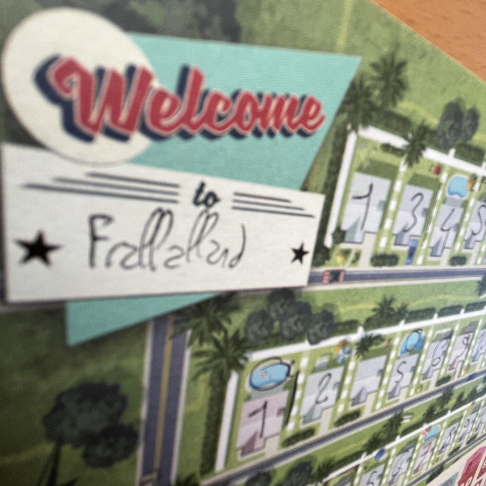
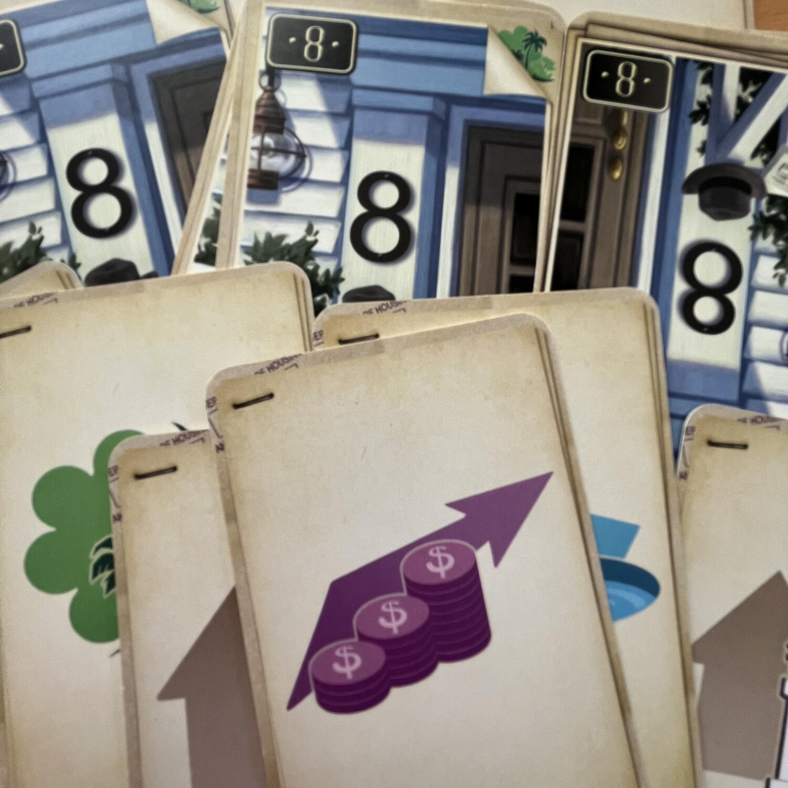

<Setting>

  In una città non meglio definita degli anni '50, i giocatori assumeranno il
  ruolo di architetti con l’obiettivo di creare un quartiere in grado di
  soddisfare i clienti più bisognosi, per convincerli ad abitare le case che
  avranno progettato.

</Setting>

<Rules>

  In Welcome to riceverete in dotazione una plancetta e di una matita. La
  plancetta conterrà tutte le informazioni necessarie, quali le casette divise
  in strade. Ogni casa avrà uno spazio in cui con la matita dovrete inserire il
  numero civico per renderla abitata.  
  Durante ogni round verranno pescate 6 carte divise in coppie, ciascuna composta
  da un servizio e da un numero civico. Voi sceglierete contemporaneamente una combinazione
  tra numero civico e servizio. Il numero civico si è sempre obbligati a inserirlo
  nel quartiere che si vuole, segnando il numero sulla plancia con la matita, pena
  il subire una penalità; il servizio invece è facoltativo. I numeri civici andranno
  inseriti in ordine crescente, ma potendo lasciare spazi vuoti, in ognuna delle
  strade.  I servizi sono un po’ il vero motore del gioco in quanto permetteranno
  ai giocatori di ottenere punti. Saper intersecare il numero civico con la giusta
  combinazione di servizi attiverà <strong> fantasmagoriche combo! </strong>. Tutto
  questo avviene mentre si cerca di soddisfare per primi degli obiettivi comuni che
  daranno ai giocatori in grado di risolverli per primi parecchi punti.

</Rules>

<Feedback>

  Welcome to è un gioco in grado di dare soddisfazioni sia a chi piace il
  meccanismo del{" "}
  <Link to="/mechanisms/costruzione-pattern">Costruzione Pattern</Link> che del{" "}
  <Link to="/mechanisms/flip-and-write">Flip & Write</Link>.  
  È innegabile che ci siano tante cose da fare e di cui tenere traccia, tra dove
  scrivere il numero civico, quale servizio usare e come evitare che l’obiettivo
  comune diventi improvvisamente irraggiungibile. Non è un gioco per tutti, e alle
  volte rischia di essere un po’ troppo astratto, ma per chi apprezza l’asciuttezza
  e l’ottimizzazione delle meccaniche, senza fronzoli tematici che rischiano di appesantire
  l’esperienza, diventerà un appuntamento fisso.
   
  P.S.: Se siete giocatori da solitario fatevi un favore e comprate assieme al gioco
  anche le carte extra per la modalità da giocatore singolo che cambieranno l’esperienza
  di gioco… “da così a così"!

</Feedback>

