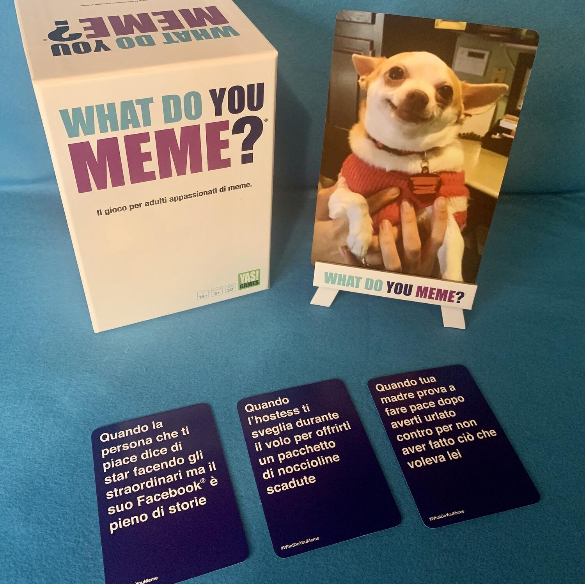
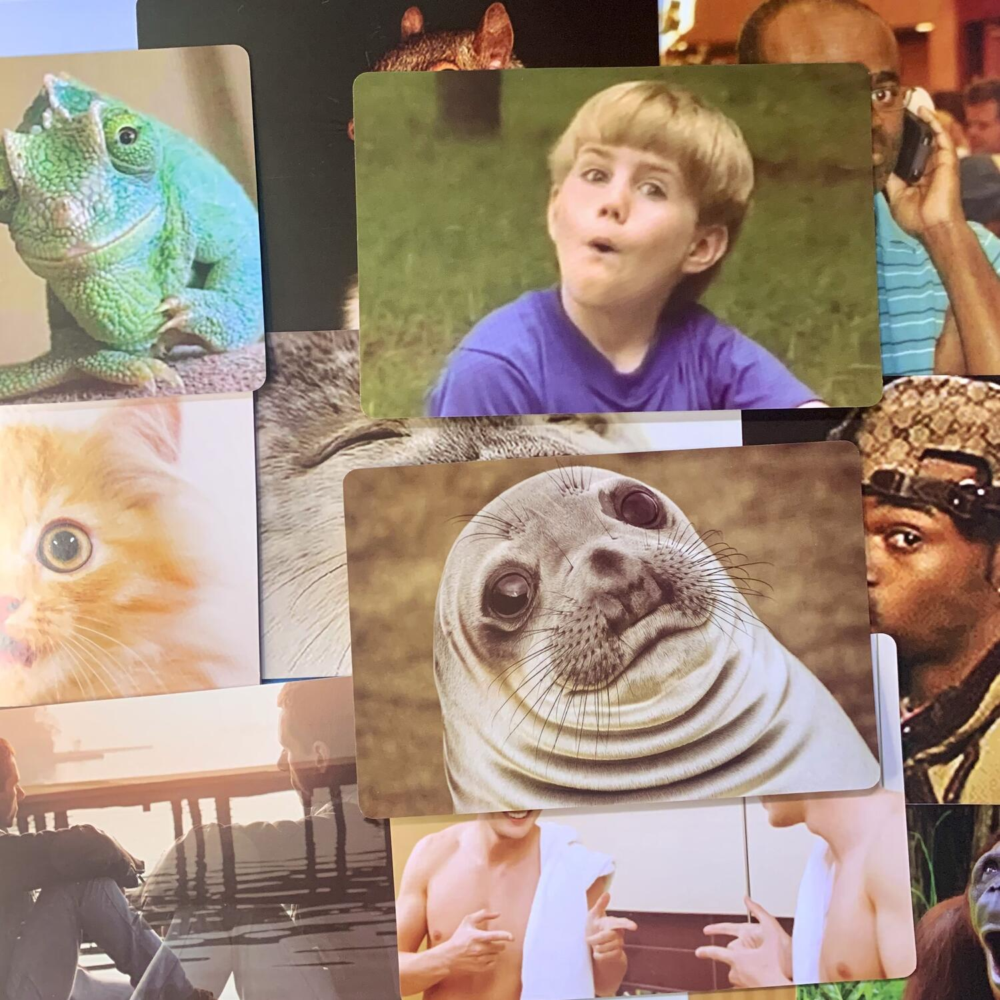

<Setting>

  Ok boomer! Iniziamo da… <strong>che cos'è un meme</strong>? 
  Sono immagini e frasi umoristiche caratterizzate da una diffusione virale sul web.
   
  Ti consideri un meme lord?
   
  <strong>Riunisci</strong> i tuoi <strong>amici</strong> dove ti pare, preferibilmente attorno ad un tavolo. Il vostro <strong>    obiettivo</strong> sarà quello di <strong>creare</strong> il <strong>meme</strong> più <strong>divertente</strong> associando le
  carte didascalia alla carta immagine presente sul cavalletto. Un giudice, eletto a rotazione, leggerà le combinazioni ad
  alta voce e decreterà il vincitore!&nbsp;

</Setting>

<Rules>

  Per giocare bisognerà seguire questi semplici step:
   
  <strong>Step 1: Preparazione</strong>
   
  Mettetevi comodi, prendete i vostri snack preferiti (dell'alcool se volete) e preparatevi per la vostra serata meme.
   
  <strong>Step 2: Gli amici</strong>
   
  Riunisci i tuoi amici più irriverenti! Si gioca da un minimo di 3 fino a un massimo di 20 giocatori.
   
  <strong>Step 3: Il giudice</strong>
   
  A ogni giro uno dei giocatori dovrà valutare quanto siano divertenti i vostri meme! Il giudice sceglie la carta
  immagine e la mette sul cavalletto, girata verso i giocatori.
   
  <strong>Step 4: Scegli la didascalia</strong>
   
  Guarda la carta immagine sul cavalletto e scegli una delle 7 carte che hai in mano. Quale didascalia crea
  l'abbinamento più esilarante? Scegli la carta e falla scivolare a faccia in giù sul tavolo.
   
  <strong>Step 5: Risate garantite</strong>
   
  Il giudice raccoglie tutte le caption e le legge ad alta voce. Alla fine del giro, la combinazione immagine-didascalia
  più divertente vince. Quando finisce il gioco? Quando si vuole! Bisognerà poi fare il conteggio dei punti e infine
  eleggere il vostro meme lord!&nbsp;

</Rules>

<Feedback>

  What do you meme è un esilarante <strong>party-game</strong> che vi farà giocare con i meme e vi regalerà tante risate
  in compagnia. La durata è variabile, dato che sarete voi a decidere la soglia di punti necessaria per la vittoria,
  rendendolo così un <strong>buon filler</strong> (per i boomer: gioco di riempimento).
   
  Si tratta comunque di un prodotto per adulti, <strong>non</strong> per famiglie o bambini: il target ideale sono
  gruppi di amici che non hanno tabù, appassionati di meme, sarcasmo, black humor e battute ironiche.
   
  La durata variabile, l'originalità, la longevità (grazie a tutte le sue espansioni in italiano e non) e il fatto che
  può essere giocato davvero dovunque sono tra i numerosi <strong>pro</strong> di questo gioco.
   
  Tra i <strong>contro</strong> devo però evidenziare il fatto che alcune immagini sono un po' sgranate e il costo è un
  po' alto per il genere di prodotto.
   
  Il mio consiglio è comunque quello di <strong>non abusarne</strong>, per evitare di vedere subito tutte le carte e le
  immagini a disposizione: usatelo come riempitivo, affiancandolo ad altri giochi, magari per aprire o chiudere una
  serata, e vedrete che ne aumenterete la longevità!
   
  Infine, se i vostri amici sono autoironici, consiglio di <strong>stampare</strong> delle foto scelte da voi (magari i
  meme che più vi piacciono o anche foto di persone che conoscete in pose ridicole), per creare dei meme più personali.
  Potete importare le immagini su word o su un altro programma di grafica, impostando le dimensioni su un normale foglio
  di lavoro, stamparle a colori ed infine plastificarle.

</Feedback>

