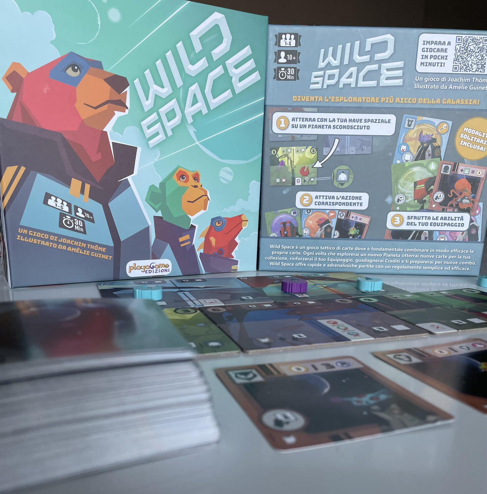
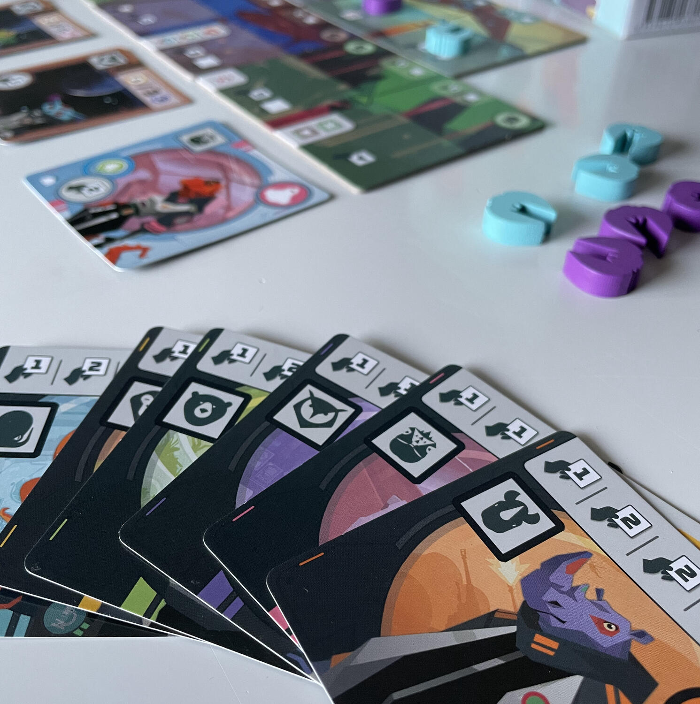

<Setting>

  Una nuova galassia è appena stata scoperta.  
  È giunto il momento di esplorarla con l'aiuto del miglior equipaggio dell'intero
  universo.
   
  Al comando della nave spaziale ti troverai a viaggiare nello spazio e dovrai arruolare
  la migliore squadra assumendo ogni tipo di specialista e beneficiando dell'aiuto
  dei robot. Dovrai inoltre adempiere alle missioni che i vari emissari dell'impero
  ti assegneranno.
   
  Riuscirai a diventare l'esploratore più ricco della galassia?

</Setting>

<Rules>

  Lo scopo del gioco è quello di creare il miglior equipaggio possibile per
  ottenere il maggior numero di crediti.
   
  Per il set-up del gioco si preparano due pianeti casa iniziali e sotto di essi
  tre pianeti a faccia in giù, che potranno essere girati solo dopo aver giocato
  un certo numero di carte equipaggio dalla propria mano. Si dispone poi il
  mazzo di pesca con accanto tre carte equipaggio scoperte che formeranno
  l'ufficio di collocamento.
   
  Ogni giocatore riceve cinque astronavi, una carta capitano e tre carte
  equipaggio dal mazzo.
   
  Nel proprio turno ogni giocatore dovrà decidere se atterrare su un pianeta,
  piazzando la propria astronave nella parte bassa del pianeta, o esplorarlo,
  spostando una pedina già presente dalla parte inferiore a quella superiore. In
  ognuna di queste zone il giocatore potrà effettuare un'azione che gli
  permetterà di pescare carte o di giocarle. Se sulla carta equipaggio giocata è
  presente un'icona abilità, il giocatore può applicarne immediatamente
  l'effetto anche se l'attivazione non è obbligatoria. In alcune di queste
  abilità è presente un'icona requisito: se questo non viene soddisfatto il
  giocatore può comunque giocare la carta equipaggio, ma non utilizzare la sua
  abilità extra. Giocando un veterano, riconoscibile dall'icona medaglia
  nell'angolo in alto a sinistra della carta, il giocatore potrà avanzare il
  proprio segnalino veterano nel tracciato presente sulla carta capitano. Ogni
  avanzamento su questo tracciato darà azioni extra o crediti a fine partita.
   
  Infine gli emissari permettono al giocatore di ottenere punti vittoria se
  vengono soddisfatti i requisiti delle loro missioni.
   
  Dopo aver eseguito i dieci possibili turni si conteranno i punti e chi ne
  ottiene di più è il vincitore!

</Rules>

<Feedback>

  Wild space è un gioco semplice, adatto anche ai neofiti, che non stanca mai.
   
  Nonostante la semplicità, richiede comunque una dose di pianificazione che
  possa permettere di giocare più carte possibili in un solo turno, grazie
  appunto alle abilità presenti sulle carte equipaggio.
   
  L'interazione tra i giocatori non è elevata, in quanto atterrare su un pianeta
  non impedisce agli altri giocatori di farlo. L'unico momento in cui ci si può
  disturbare è nel momento della pesca delle carte, tentando di soffiare qualche
  carta utile agli avversari, o utilizzando l'opzione facoltativa di ripristino
  dell'ufficio di collocamento.
   
  Il set-up è piuttosto variabile grazie alla presenza di ben 6 carte capitano,
  che daranno diversi bonus e punti, e alla scelta delle tessere pianeta da
  utilizzare durante le partite.
   
  Il gioco prevede una modalità solitaria ottima, molto sfidante grazie anche ai
  tre livelli di difficoltà.
   
  I materiali sono ben fatti, le illustrazioni sono molto particolari ma rendono
  bene nel complesso. L'iconografia risulta molto chiara sin da subito, così da
  non richiedere una continua consultazione del regolamento per poterla
  decifrare.
   
  Sono presenti anche due espansioni, una delle quali è scaricabile come print
  and play direttamente dal sito dell'editore.

</Feedback>

