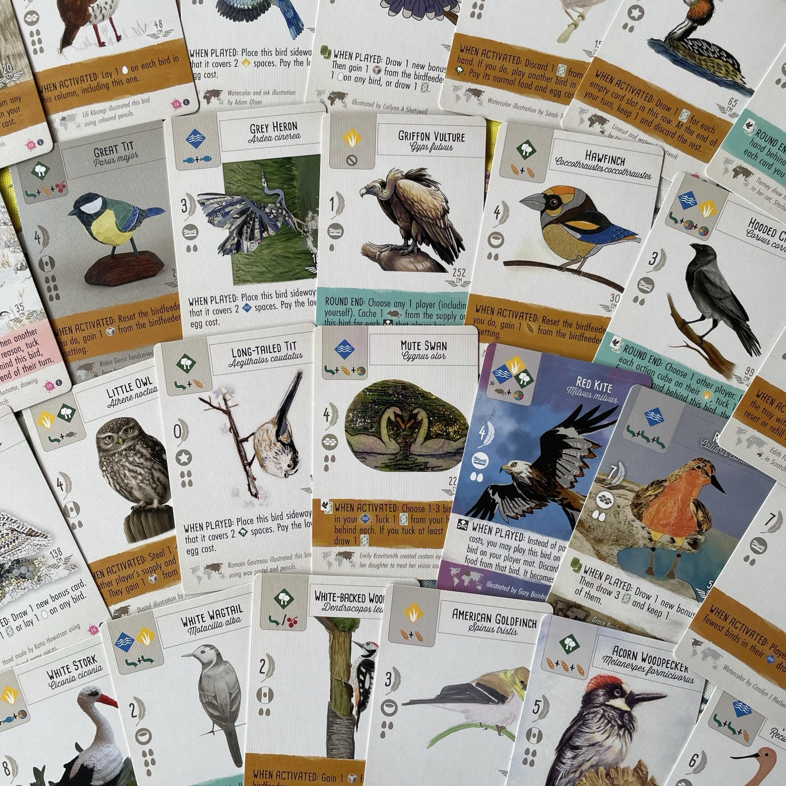
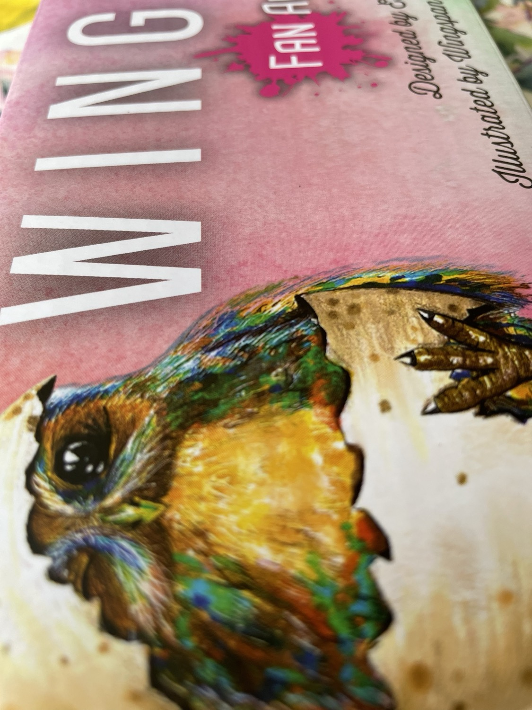

<OriginalReviewLink slug="wingspan" />

<Panoramic>

  Questo pacco contiene <strong>255 carte uccello</strong> di Wingspan, <strong>nessuna delle quali inedita</strong> (appartengono al <em>base</em>, nonché alle <em>espansioni</em> di <em>Europa</em>, <em>Oceania</em> e <em>Asia</em>). La <strong>novità</strong> rispetto al contenuto già in circolazione è data dalla variazione dell’<strong>artwork</strong>: fan provenienti da tutto il mondo ludico hanno partecipato alla creazione delle <strong>nuove illustrazioni</strong>, che a volte ridisegnano del tutto e altre volte riproducono con <strong>tecniche diverse</strong> dagli originali alcuni tra gli uccelli <strong>più iconici</strong> rappresentati in questo gioco. Troverete pertanto la variante acquerellata, quella a matita, quella digitalizzata, quella ricamata o all’uncinetto, perfino quella “ludica”. 

</Panoramic>

<Feedback>

  Gli amanti di Wingspan apprezzeranno questo <strong>pacco celebrativo</strong> di <strong>uno dei titoli più giocati al mondo</strong> degli ultimi anni. Una <strong>galleria spettacolare di illustrazioni</strong>, in molti casi stilisticamente peculiari, spesso molto** più colorate, vivaci, perfino gradevoli** di quelle originali: se scorrendo queste ultime si aveva già l’impressione di spulciare un’<strong>enciclopedia ornitologica</strong> (cromaticamente e strutturalmente uniforme), le carte dei fan portano in vita molte delle creature raffigurate, occupandole in attività di varia natura. <strong>Sostituire le carte originali</strong> sarà spesso una tentazione forte, anche a costo di perdere uniformità grafica rispetto al resto della collezione. Gli autori delle nuove illustrazioni saranno orgogliosi di aver partecipato a un progetto del genere e gli appassionati vorranno di certo avere un <strong>pezzo da collezione</strong> come questo pack; tuttavia, <strong>non necessariamente tutti i giocatori di Wingspan dovranno possederlo</strong>. Se siete desiderosi di <strong>approfondire alcune meccaniche</strong> appartenenti a espansioni che non avete, senza acquistarle, con questo pack avete la possibilità di farlo, anche se non ci sarà il regolamento a supportare eventuali vostri dubbi e anche se non tutte le meccaniche saranno concretamente rappresentate (ad esempio, non potrete sperimentare il funzionamento del nettare, che comunque non è strettamente necessario). Nel caso in cui, invece, questo per voi non fosse uno scopo da perseguire o non foste collezionisti, non consiglio l’acquisto del Fan Art Pack. È vero che a volte la forma è sostanza e che gli <strong>add-on</strong> amplificano il piacere stesso del gioco, ma in questo caso il piacere appartiene principalmente agli editori e agli artisti, che hanno avuto l’opportunità di consacrare (e consacrarsi) con un <strong>artefatto eccellente</strong> di cui, per quanto <strong>esteticamente gradevole e apprezzabile</strong>, <strong>non si sentiva “ludicamente” alcun bisogno</strong>. 
Un’ultima nota sullo stoccaggio delle carte: se volete <strong>imbustarle</strong>, la confezione (per quanto integralmente amica dell’ambiente) non sarà per nulla sufficiente… 

</Feedback>

