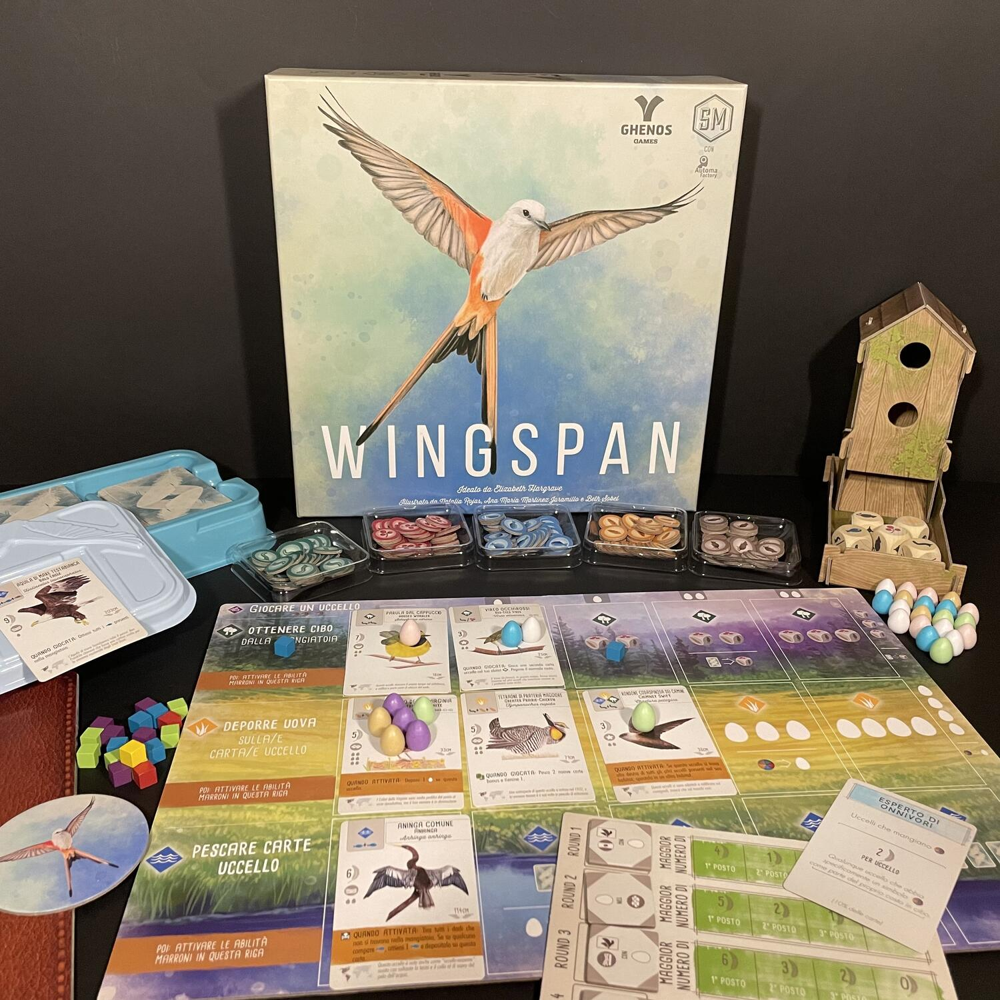
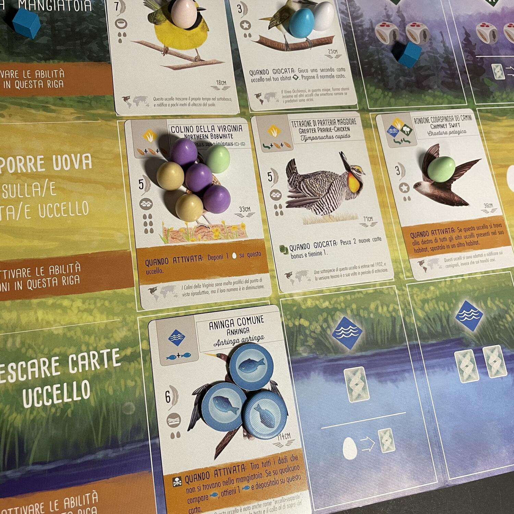

<Setting>

  Se prima di incappare in quell'episodio di “The Umbrella Academy” dove Hazel e Agnes flirtano guardando uccelli
  (niente doppi sensi!) non vi domandavate nemmeno lontanamente cosa fosse il birdwatching, sembra proprio che vi sia
  sfuggito un aspetto essenziale della vita media ludica del XXI secolo, perché, a quanto pare, osservare il
  comportamento della grande comunità dei volatili nei loro habitat naturali di questi tempi va proprio di moda! Anzi, è
  ora di deporre qualche uovo!

</Setting>

<Rules>

  I giocatori selezionano cinque elementi di partenza, scegliendo tra un set iniziale di 5 carte uccello e 5 segnalini
  cibo differenti. Scelgono, inoltre, una carta obiettivo tra le due inizialmente ricevute.
   
  La plancia obiettivi è double face e, una volta scelto il lato per la partita, ospiterà 4 obiettivi. Nella mangiatoia
  sono presenti sin dall'inizio tutti e cinque i dadi, mentre tre carte uccello rivelate sono da subito a disposizione
  di tutti i giocatori.
   
  Le plance individuali, tra loro identiche, sono organizzate per file di azioni: giocare una carta uccello pagandone il
  costo in segnalini cibo ed eventuali uova, ottenere cibo dalla mangiatoia, deporre uova sugli uccelli con nidi e
  pescare carte uccello dal mazzo comune o fra i tre sempre visibili. Ognuna delle ultime tre azioni è associata in
  ciascuna plancia a 5 spazi, pronti a ospitare altrettante carte: ogni fila in particolare corrisponde a un certo tipo
  di habitat. Aumentare il numero di carte uccello nella stessa fila significa essenzialmente guadagnare bonus crescenti
  nell'azione corrispondente. Selezionare un'azione significa invece attivare in sequenza da destra a sinistra l'intera
  fila delle carte uccello giocate nel relativo habitat.
   
  I giocatori si alternano giocando i loro 8 cubetti azione sulla fila che intendono attivare, partendo dallo spazio
  vuoto più a destra. Il testo di ogni carta uccello indicherà eventuali abilità da attivare ripercorrendo a ritroso la
  fila. Quando tutte le azioni sono state giocate, il round finisce e si ottengono punti per l'obiettivo corrente.
  All'inizio del round successivo si disporrà sempre di un'azione in meno rispetto al precedente, perciò 7 il secondo, 6
  il terzo e 5 il quarto.
   
  La partita finisce alla fine del quarto round. Oltre ai punti di fine round, i giocatori otterranno punti anche per il
  numero di uova deposte, il cibo collezionato sulle carte uccello della loro plancia, le carte collocate sotto altre
  carte, le carte obiettivo… Evidentemente, chi ha più punti vince e i segnalini cibo accumulati romperanno eventuali
  parità.

</Rules>

<Feedback>

  Wingspan ha il potere di mettere d’accordo tutti e intratterrà gradevolmente allo stesso tavolo neofiti e veterani :
  non per nulla secondo BGG risulta il titolo più giocato al mondo ad aprile 2022. Non capita spesso, dopotutto, di
  imbattersi in un gioco che metta insieme un raffinato gusto estetico nei materiali (di lusso) - in particolare
  nell’artwork, che ha fatto scuola, inaugurando una sfilza di titoli stile naturalismo “color pastello” (come{" "}
  <Link to="/reviews/cascadia">Cascadia</Link>) - senza peraltro far lievitare oltremodo i costi; che offra una certa
  linearità senza scadere nella banalità; che curi la profondità strategica senza obbligare a inutili e contorti
  barocchismi; che si fondi su una serie di meccaniche coerenti ma non ripetitive; che sfoggi un’accurata conoscenza
  ornitologica senza scivolare in arida erudizione (peraltro, imparare giocando non è mica cosa di poco conto, dato che
  la didattica ludica pare proprio la forma di apprendimento più significativa).
   
  Certo il tema ha stupito in molti alla sua pubblicazione: ma quando le case editrici propongono titoli sulla vita
  segreta di gatti esplosivi e di unicorni instabili, in fondo, diventa legittimo domandarsi perché mai i volatili
  dovrebbero mancare all’appello dell’inclusiva comunità dei giochi da tavolo.
   
  La communis opinio vuole che l’ambientazione non si senta affatto e sia pretestuosa, ma dietro le aspettative deluse
  di chi avrebbe voluto un titolo più aderente al tema proposto sembra di scorgere sostanzialmente il narcisismo di chi
  al tavolo si concentra solo sulla costruzione di un motore di gioco. È chiaro che la compagnia con cui si fa
  un’esperienza di gioco condiziona la percezione e il godimento dell’esperienza stessa, ed è altrettanto chiaro che
  nessun gioco replicherà sempre mimeticamente la vita ma, come per l’implicito patto narrativo tra lettore e scrittore,
  anche per i giochi da tavolo vige una sorta di “patto ludico”: per chi crede a queste e altre “sciocchezze”, quindi,
  se c’è una cosa che non si può rimproverare a Wingspan è proprio l’assenza di ambientazione.
   
  Le espansioni in circolazione aumentano certamente - anche se non troppo - la complessità del titolo, ma ne
  incrementano sensibilmente la longevità (già abbastanza alta per la varietà di carte uccello, segnalini obiettivo e
  carte obiettivo).
   E ora, vergognatevi un po’ della vostra sfrontata malizia e correte a giocarlo!

</Feedback>

