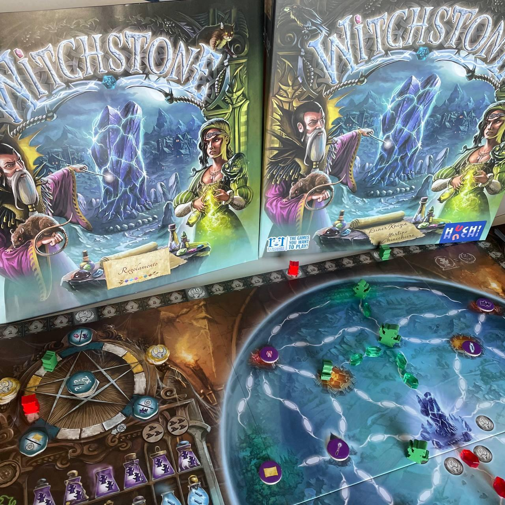
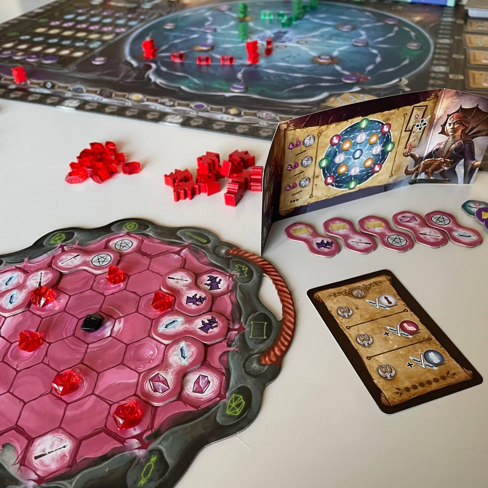

<Setting>

  Tremate, tremate! Le streghe sono tornate!
   
  Ogni cento anni maghi e streghe si riuniscono per rigenerare la leggendaria
  pietra sacra. Lo scopo del raduno è quello di ricaricare il campo magnetico
  che la circonda ma, attraverso l'uso di potenti incantesimi e rituali, ognuno
  dei partecipanti ne approfitta per accrescere e rafforzare i propri poteri.
   
  La gilda ha radunato i suoi adepti intorno alla pietra.
   
  Fai del tuo meglio per potenziare i tuoi incantesimi ed essere così dichiarato
  custode della Witchstone per i prossimi cento anni.

</Setting>

<Rules>

  Questo gioco ci trasporta nel mondo della magia, tra streghe e stregoni che
  cercano di accrescere e rafforzare i loro poteri.
   
  Ogni giocatore all'inizio della partita si sistemerà in una delle quattro
  torri di partenza che circondano la Witchstone: negli undici turni di gioco
  dovrà piazzare all'interno del proprio calderone una tessera raffigurante due
  delle sei possibili azioni ed eseguirle. Ma attenzione, perché non tutte le
  tessere saranno sempre a disposizione. Bisognerà quindi creare la giusta
  combinazione di azioni all'interno del nostro calderone, cercando di
  Posizionare i simboli stampati sulle tessere vicino ad altri simboli uguali,
  per poter massimizzare le opportunità che si presenteranno.
   
  Usate l'energia per collegare i luoghi all'interno della sfera di cristallo,
  mandate le streghe in missione a raccogliere nuovi incantesimi, tracciate le
  linee del pentacolo, spostate i cristalli all'interno del calderone per
  poterli attivare, raccogliete carte profezia per ottenere punti e non
  dimenticate di utilizzare la bacchetta!

</Rules>

<Feedback>

  L'idea di base parte da un gioco dello stesso Knizia del 2004, Geniale!, un
  astratto ben costruito, ma molto asciutto. In Witchstone, il sistema di
  piazzamento tessere è il medesimo, con l'aggiunta di un'ambientazione più
  ricca che, pur non essendo particolarmente aderente alle meccaniche di gioco,
  rende molto bene a livello grafico.
   
  Durante le prime partite si ha l'impressione di ritrovarsi davanti a una serie
  di azioni slegate tra loro, ma con un po' di esperienza di gioco si noterà
  quanto sia fondamentale creare un motore d'azione tale da poter sfruttare al
  meglio le azioni a nostra disposizione.  
  La rigiocabilità del titolo è data sia dalla pesca casuale delle tessere da piazzare
  nel calderone, che determineranno ogni volta una strategia diversa, sia dall'acquisto
  delle carte profezia, che consentono diversi modi per ottenere punti a fine partita.
   
  I materiali, sia in legno che in plastica, sono ottimi e le plance giocatore abbastanza
  spesse.
   
  Gli schermi dei giocatori sono dotati di un pratico schema per avere chiari i luoghi
  all'interno della sfera di cristallo, spesso non molto visibili per la presenza
  dei segnalini strega.
   
  All'interno della scatola tutto è diviso alla perfezione e tutti i componenti trovano
  perfettamente posto, compreso l'enorme tabellone.
   
  Il regolamento è ben fatto e riporta molti esempi che tolgono ogni dubbio e semplificano
  la spiegazione del gioco, come la descrizione delle carte profezia ed i simboli
  sul tracciato bacchetta.
   
  Il gioco gira bene sia in due giocatori che in quattro. In questo caso bisognerà
  valutare al meglio su quali azioni puntare per prime, al fine di non perdere la
  priorità sui sentieri di energia o sulle tessere da raccogliere nei luoghi.
   
  In conclusione il gioco è un peso medio che, nonostante la presenza di tante possibili
  azioni all'interno della partita, riesce a coinvolgere anche i giocatori meno esperti.

</Feedback>

