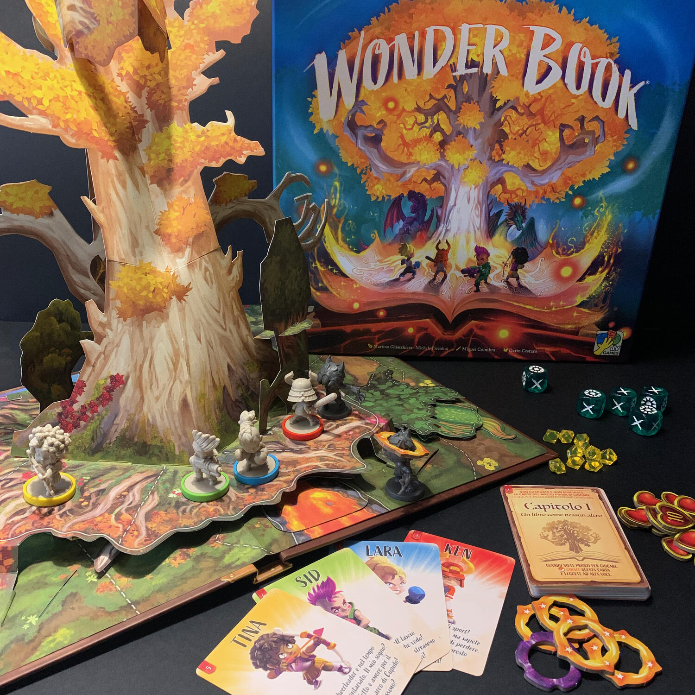
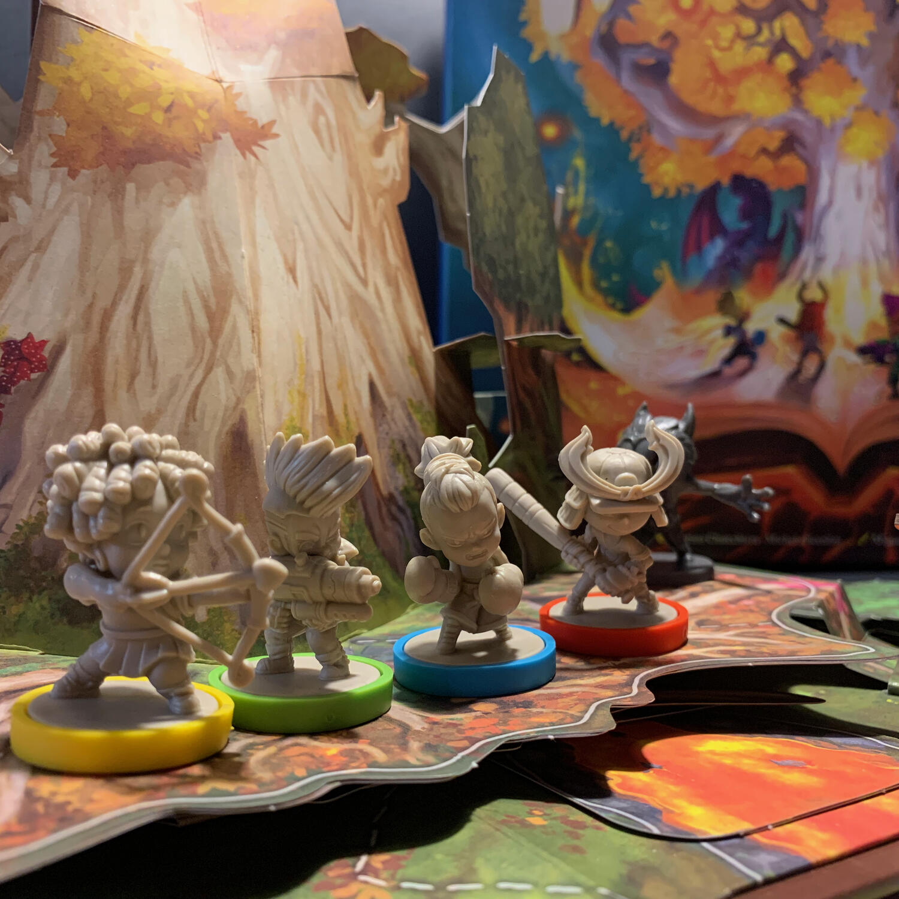

<Setting>

  C'era una volta Oniria, il mondo di un'antica civiltà di draghi.
   
  C'era una volta un tempo in cui Oniria era unita, senza distinzione tra luce e oscurità.
   
  C'era una volta la pace.
   
  Ora, Oniria è divisa in due regioni: la luminosa Upperworld e l'oscura Underworld. Upperworld è una terra fiorente e
  abitata da draghi lucenti, che danzano e respirano magia. Underworld, invece, è un groviglio di nere caverne
  brulicanti di creature schive e furtive.
   
  L'unico modo per accedere ad Oniria è il Wonder Book, un antico tomo rinchiuso in una torre abbandonata, capace di
  aprire un portale per i nostri eroi: Ken, Tina, Lara e Sid.
   
  Ora il Wonder Book è sul vostro tavolo, pronto per essere aperto e per far apparire il mondo di Oniria. Sta aspettando
  solamente voi.
   
  Riuscirete a salvarla?

</Setting>

<Rules>

  Dopo aver scelto lo scenario, da svolgere in ordine dal primo al sesto, e dopo aver preparato le 5 clessidre, si gira
  la prima carta del mazzo e si inizia a leggere. Si viene così catapultati nel mondo di Oniria e si viene a conoscenza
  del susseguirsi degli eventi, degli obbiettivi che si dovranno compiere e delle prove che si andranno ad affrontare.
   
  Ogni giocatore, impersonando uno dei quattro ragazzi, compirà, ogni turno, tre azioni tra queste: muovere, attaccare i
  Wyrm (i nemici), passare oggetti ai compagni, raccogliere scintille o attivare attività speciali.
   
  Come funziona l'attacco? Ogni ragazzo ha abilità e attacchi diversi, che andranno a espandersi durante il corso delle
  varie campagne. Attaccare significa leggere sulla carta del personaggio quanti dadi lanciare e quanti nemici sarà
  possibile colpire. L'attacco, solitamente, fa un danno a un Wyrm che, dopo essere stato azzoppato, al raggiungimento
  delle due ferite, lascerà il mondo di Oniria.
   
  Cosa è una scintilla? È una delle monete del gioco, una pietra che, se scartata, permette di attivare delle abilità
  speciali.
   
  Gli scenari, inoltre, vi porteranno a dover prendere delle decisioni che andranno minimamente a caratterizzare la
  vostra storia, spingendovi così a cercare di fare la scelta giusta (o meglio la più coerente). In caso di errore si
  rischia di avere una ricompensa minore o un piccolo malus.
   
  Una volta che tutti i ragazzi hanno giocato, nell'ordine che vogliono, toccherà ai Wyrm: si pescherà una carta nemico
  e si farà quanto scritto. È in questa fase che i nemici verranno a cercarvi e ad "accarezzarvi" come solo loro sanno
  fare, provocando un danno per ogni attacco. Se il personaggio raggiunge i zero punti vita, niente paura: risorge...
  sacrificando però una clessidra, che si volterà sul lato grigio. Le clessidre colorate (ovvero non grigie) non sono
  altro che il punteggio, il voto, con il quale si completerà lo scenario: più sono, meglio è.

</Rules>

<Feedback>

  Come avete capito, Wonder Book è un ottimo titolo introduttivo, basato su una bella storia capace di coinvolgervi e di
  non farvi staccare dalla plancia fino alla sua conclusione.
   
  Aprire un pop-up book è sempre una bellissima esperienza e fa tornare indietro a quei begli anni in cui l'unica
  preoccupazione era quella di non perdere la puntata dei BikerMice su BimBumBam.
   
  Il gioco, di per sè, è semplice e adatto a tutti, soprattutto ai bambini (dagli 8/10 anni) che stanno facendo i primi
  passi nel mondo dei giochi da tavolo.
   
  Inoltre, questo titolo, porta a galla tematiche molto attuali, come il bullismo e il razzismo, appiglio da poter
  cogliere per parlarne con i più piccoli in modo leggero.
   
  Ad esempio Ken, uno dei quattro ragazzi, è vittima di bullismo per le sue origini straniere che lo hanno portato a
  ripudiare le sue radici; Tina è una ragazza cresciuta in un ambiente familiare complicato, a tal punto da chiamare il
  suo cane Cupido, nella speranza che questo riavvicinasse i suoi genitori; Lara è una ragazza tutta pepe che finiva
  spesso a fare rissa con gli altri bimbi che facevano nonnismo su suo fratello; ed infine Sid è un ragazzo irrequieto,
  cresciuto con una famiglia composta da un padre militare, sempre via per lavoro.
   
  Cambiando discorso, a livello materico è davvero ben fatto e il libro è davvero resistente, gli inserti nella scatola
  davvero ben fatti.
   
  Se vogliamo trovare un po' di lati negativi, possiamo dire che le miniature dei Wyrm sarebbe stato bello se fossero
  state un po' diversificate e che sei scenari sono pochi anche perché, una volta giocati, non ti sfidano abbastanza per
  rigiocarli nuovamente, dato che si sa già cosa succederà.
   
  Nonostante questo, io ne consiglio sicuramente una partita e vi assicuro che ogni volta che lo mostro ad amici, lo
  vogliono provare immediatamente.

</Feedback>

