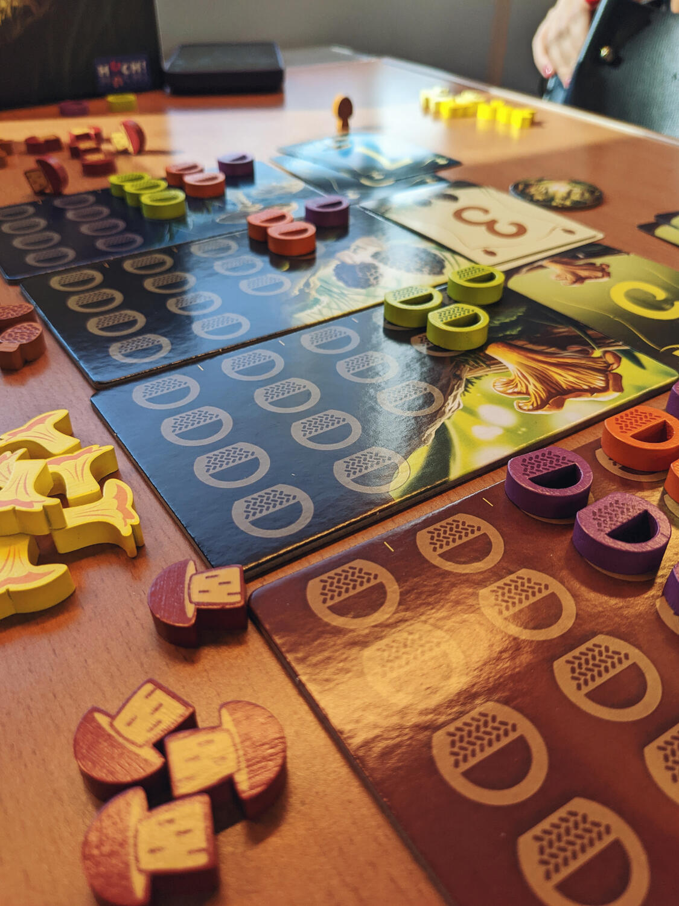
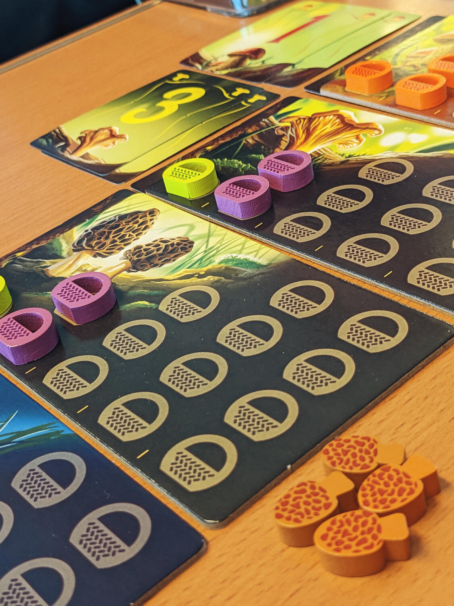
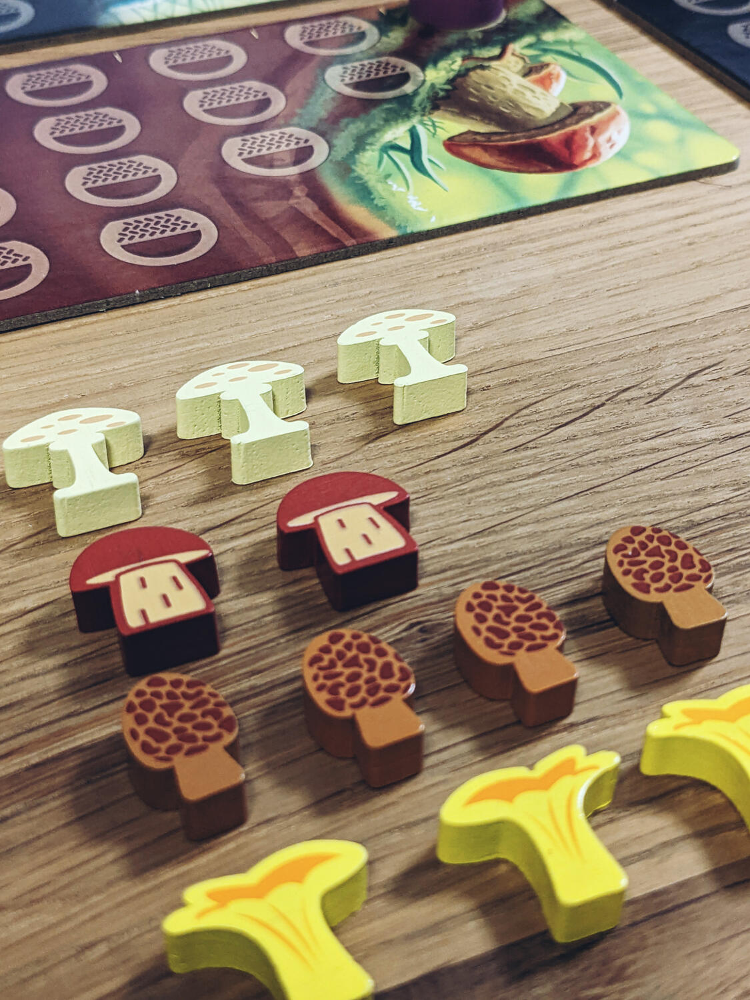

<Setting>

  In Wonder Woods ti troverai in una foresta incantata, dove la natura regna
  sovrana e dove mille segreti sono ancora da scoprire. In questo fantastico
  regno stai cercando prevalentemente funghi! Andrai in giro per la foresta con
  il tuo bel cestino di vimini e raccoglierai diverse varietà di funghi, che
  però non avranno tutti lo stesso valore! Riuscirai a raccogliere quello più
  redditizio e che ti farà vincere la partita?
   

</Setting>

<Rules>

  Ad ogni fungo viene assegnato un valore casuale (1; 3; 5; 7), sconosciuto a
  tutti i giocatori. L'obiettivo del gioco è quello di capire il valore di
  ciascun fungo e collezionare il maggior numero di funghi con un valore alto.
  La raccolta dei funghi avviene con un meccanismo di area majority: più cestini
  si investono in un tipo di fungo, più funghi di quel tipo si collezioneranno.
   
  All'inizio del gioco a ogni giocatore verrà assegnata una mano di carte, le
  quali inizieranno a dare informazioni su alcuni funghi e, nel corso della
  partita, ci sarà la possibilità di rivelare qualche carta aggiuntiva. In
  questo modo, i giocatori potranno dedurre il valore di ciascun fungo e
  soprattutto quale valga la pena raccogliere.
   
  Naturalmente non ci sarà mai la certezza assoluta di quale sia la scelta
  migliore: occorrerà quindi fidarsi un po' del proprio istinto!
   

</Rules>

<Feedback>

  Wonder Woods è un gioco molto semplice, divertente e spiritoso, che combina in
  modo molto interessante la deduzione e l'area majority, dando vita ad una
  dinamica estremamente veloce e semplice, che lo rende facile da intavolare con
  qualunque giocatore e in qualunque momento. Inoltre, i componenti sono di
  buona qualità: in particolare, i meeples che rappresentano i cestini di vimini
  e i funghi sono estremamente carini!&nbsp;
   
  Ci si innamora di questo gioco dalla prima partita: consigliato caldamente ad
  ogni tipo di giocatore per concludere una serata giochi o per quando si hanno
  pochi minuti a disposizione.
   

</Feedback>

