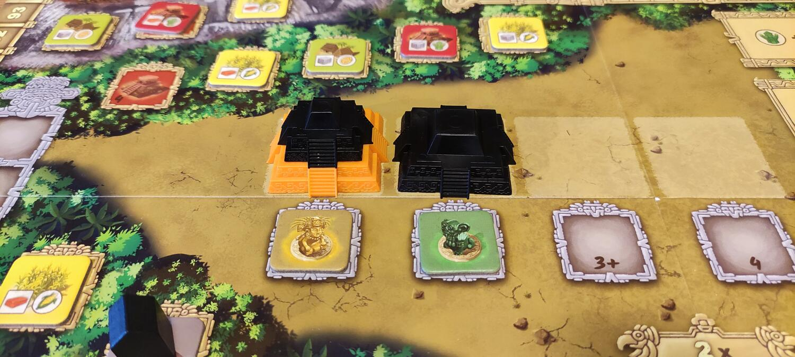
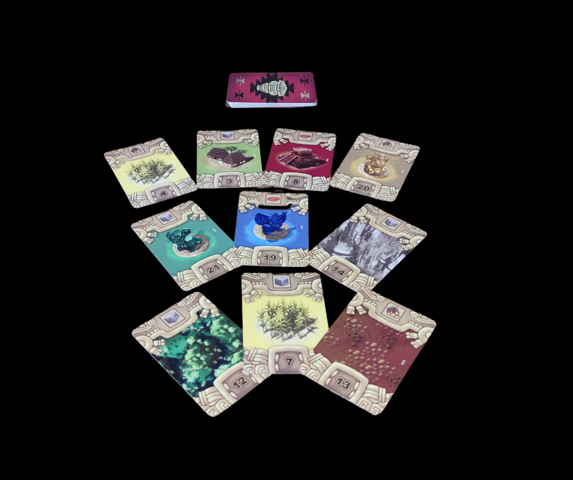

<Setting>

  Gli Zapotechi erano una civiltà precolombiana di circa 2500 anni fa, meno
  celebri di Maya o Aztech forse, ma non meno floridi e prosperi! Dovremo
  costruire i villaggi, campi di grano, edificare piramidi, fare rituali e
  sacrifici. Indovinate per cosa? Ovvio, per onorare gli Dei! Cavolo, doveva
  essere veramente impegnativo entrare nelle loro grazie e questo bel gioco ce
  lo dimostrerà!

</Setting>

<Rules>

  A inizio turno i giocatori scelgono una delle 4 carte Azione ricevute
  all'inizio del gioco dalla loro mano, con il numero in calce che determina
  l'ordine di turno. Quindi si eseguono le seguenti fasi:
   
  <strong>Rendita</strong>: In base alla carta selezionata, si sceglie una riga
  o una colonna dalla plancia riportante l'icona della risorsa corrispondente.
  Poi si ottengono tutte le risorse presenti. Si noti che a inizio partita la
  tabella è vuota, ma andrà riempiendosi durante il gioco.
   
  <strong>Azioni</strong>: Si svolgono tutte le azioni che è possibile fare con
  le risorse ottenute. <em>Le azioni sono:</em>   
  <ol>
    <li>      <strong>Commercio</strong>: Acquisto delle tessere commercio dal
      tabellone, che servono per ottenere o scambiare risorse e altre azioni.</li>
    <li>      <strong>Piramide</strong>: si costruisce un livello della propria
      piramide. Si può iniziarne una personale oppure continuare la costruzione
      di un avversario.Si può costruire un solo livello di una piramide per
      turno.</li>
    <li>      <strong>Rituale</strong>: un giocatore che ha costruito almeno un livello
      di una piramide può svolgere un rituale, collocando un dischetto su una
      delle 3 carte rituale. Queste conferiranno bonus e punti a fine partita.</li>
    <li>      <strong>Sacrificio</strong>: permette di avanzare sul tracciato
      Sacrificio. Ogni livello garantisce dei bonus. A fine partita si ottengono
      punti in base all'avanzamento sul tracciato.</li>
    <li>      <strong>Costruzione</strong>: si può costruire uno degli edifici
      rispettando il requisito imposto dalla carta azione giocata, pagando le
      risorse richieste in base al tipo di edificio che si vuole costruire. Si
      colloca una casa sul tabellone, si prende la tessera presente in quello
      spazio e la si mette sulla plancia personale, in uno spazio a scelta.
      Servirà a dare le risorse durante la fase rendita.</li>
    <li>      <strong>Costruire il Palazzo</strong>: è un edificio speciale e ognuno ne
      ha uno per partita. Non serve per produrre risorse ma nella conta dei
      punti vale come due case. Sempre rispettando i requisiti della carta
      scelta, la si piazza con una casa su uno spazio del tabellone che abbia
      una tessera edificio. Si prende quest'ultima e la si gira coperta al posto
      di quella del palazzo sulla plancia personale.</li>
  </ol>
  <em>Dopo la fase azioni, si passa al conteggio dei punti.</em>   
  Ogni giocatore ottiene 2 punti per ogni edificio presente sul tabellone che rispetta
  il requisito della carta Azione posta al centro del tabellone durante il setup.
  Poi sceglie una carta Azione tra quelle presenti nell'Offerta e la aggiunge alla
  sua mano.
   
  Il turno passa poi al giocatore successivo. Quando tutti hanno giocato si prepara
  il nuovo Round. Nell'offerta rimarrà solo una carta Azione, che diventa la nuova
  carta da mettere al centro del tabellone per l'assegnazione dei punti del prossimo
  round.
   
  Le carte Azione giocate nel turno precedente formeranno invece la nuova offerta,
  insieme a una nuova carta pescata dal mazzo.  
  <strong>La partita termina dopo 5 round.</strong>
   
  Ai punti ottenuti durante il proprio turno si aggiungono quelli delle
  piramidi: ogni giocatore che ha contribuito otterrà punti per ogni edificio
  che corrisponde alla tessera scelta durante la costruzione, dal tracciato dei
  sacrifici in base a chi si trova più in alto e dalle carte rituale.
   
  Chi ha più punti, è il vincitore!

</Rules>

<Feedback>

  Zapotec è un peso medio. È di facile apprendimento, ma un po' stretto e ostico
  da padroneggiare. Il motore di produzione risorse che aumenterà
  esponenzialmente durante la partita vi darà grandi soddisfazioni. Scegliere
  simultaneamente le carte da giocare a inizio round snellisce un po' il gioco,
  anche se è il classico titolo da paralisi da analisi: i 60' sono indicativi,
  in 3 giocatori 90' ci vogliono tutti. Alta è la rigiocabilità, data dalla
  disposizione casuale delle tessere edificio sul tabellone e dalle carte. Il
  gioco non ha un editore italiano, ma è indipendente dalla lingua e Giochix lo
  vende col manuale tradotto. Per quanto riguarda la scalabilità, è preferibile
  giocarlo in 3: in due infatti è un po' largo, mentre in 4 diventa strettissimo
  e i tempi morti aumentano. Quanto ai componenti, le piramidi sono un bel
  vedere, le tessere edificio e le carte ben fatte, ma le plance personali sono
  troppo fini.
   
  Oggi i giochi possono sembrare un po' tutti uguali tra loro, ma ognuno ha la
  sua particolarità e questo è il caso di Zapotec! Un gioco stretto, sempre
  diverso, con poche regole, che dura il giusto e che vi terrà impegnati una
  bella oretta abbondante! Da provare!

</Feedback>

