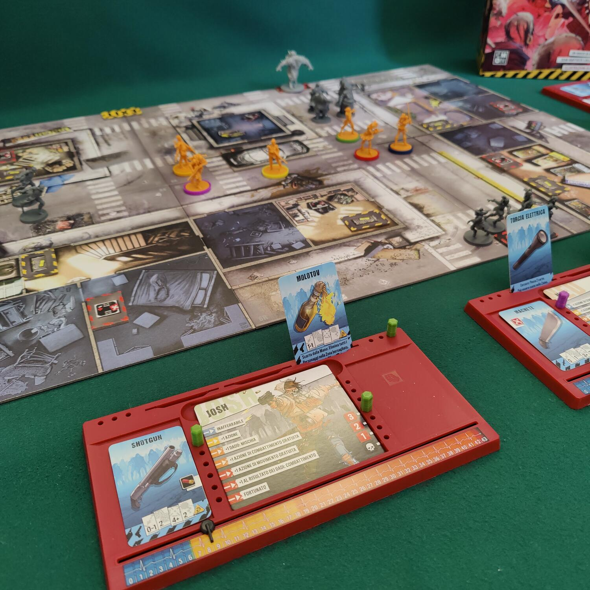
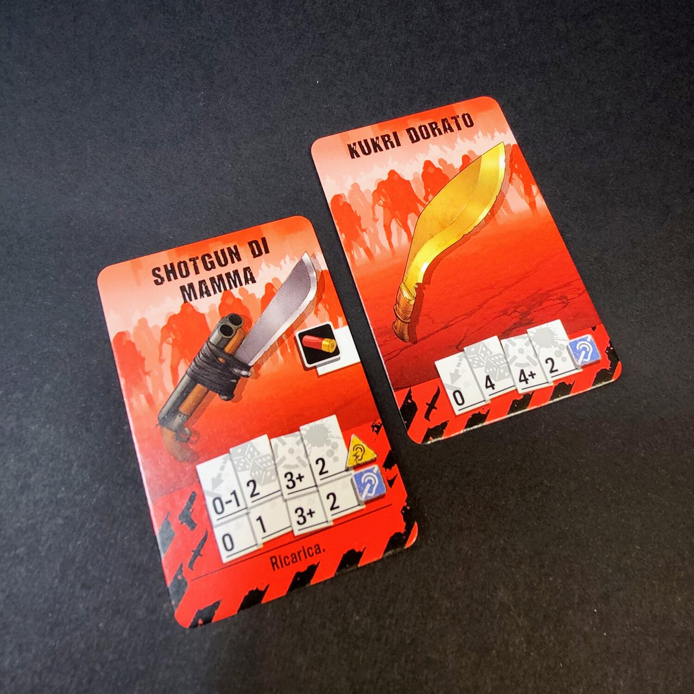

<Setting>

  Eravamo persone normali, rispettose della legge, ognuna con i propri sogni e
  la propria vita.
   
  Poi tutto è cambiato in pochi, drammatici momenti. L'apocalisse ha segnato la
  fine del mondo per come lo conoscevamo e lo amavamo. Tutto questo ha svelato
  il nostro lato più nascosto e selvaggio, il nostro desiderio di lottare, di
  non soccombere alle orde di zombie, che oramai imperversano in ogni città.
   
  Ci armeremo di qualsiasi cosa possa permetterci di difendere le nostre vite,
  fucili, mazze chiodate, molotov, motoseghe, e venderemo cara la pelle.
   
  Questo non diventerà un mondo zombie! È l'ora di Zombicide!

</Setting>

<Rules>

  Zombicide è un gioco collaborativo, in cui sei sopravvissuti,
  indipendentemente dal numero di giocatori, prendono parte ad una delle 25
  missioni presentate dal manuale, cercando di raggiungere tutti gli obiettivi.
   
  Ci si muove su una mappa differente in ogni missione, composta da tessere,
  all'interno della quale sarà possibile trovare nuove armi e modificare il
  proprio equipaggiamento. Ogni arma riporta le indicazioni per il suo uso, se è
  da mischia o a distanza, quanti dadi tirare, che risultato minimo fare per
  colpire e quanti danni fa ogni colpo.
   
  Ogni round si compone di due fasi, prima quella dei{" "}
  <strong>Giocatori </strong>e poi quella degli <strong>Zombie</strong>. 
  Durante la <strong>fase dei giocatori</strong>, ogni sopravvissuto ha <strong>    3 azioni</strong> e dovrà scegliere tra
   
  <ul>
    <li>      <strong>Moversi</strong></li>
    <li>      <strong>Cercare</strong></li>
    <li>      <strong>Aprire una porta</strong></li>
    <li>      <strong>Scambiare oggetti</strong></li>
    <li>      <strong>        Attaccare (in mischia <em>o</em> a distanza)</strong></li>
    <li>      <strong>Prendere un obiettivo</strong></li>
    <li>      <strong>Fare rumore</strong></li>
    <li>      <strong>Non fare nulla</strong>{" "}</li>
  </ul>
  Durante la <strong>fase Zombie</strong> prima di tutto ogni cattivone spende
  un'azione per <strong>attaccare</strong> un sopravvissuto, se possibile, o{" "}
  <strong>muoversi</strong> verso un sopravvissuto o una zona di rumore. Poi,
  dalle zone di generazione compaiono nuovi Zombie.
   
  Più Zombie ucciderete, più il vostro sopravvissuto aumenterà il suo livello di
  adrenalina. Questo vi permetterà di acquisire nuove abilità, ma gli zombie
  generati saranno maggiori per numero.
   
  Sul vostro cammino troverete 4 tipi di Zombie:
  <ul>
    <li>      <strong>Deambulante</strong> 1 punto vita</li>
    <li>      <strong>Bruto </strong>2 punti vita</li>
    <li>      <strong>Corridore </strong>1 punto vita</li>
    <li>      <strong>Abominio </strong>3 punti vita</li>
  </ul>
  Ognuno di loro ha differenti caratteristiche e per ucciderli dovrete causare
  loro i danni necessari con una singola azione di attacco.

</Rules>

<Feedback>

  Zombicide 2 ed. è un gioco molto divertente. Il primo impatto con le orde di
  Zombie potrebbe mettervi in soggezione, ma capirete presto che lo scopo del
  gioco è proprio quello di fare del grande sterminio di cattivi la base del
  gioco!
   
  Le illustrazioni sono semplicemente fantastiche, i colori invitanti e allegri:
  se ne apprezza il netto contrasto con il tema del gioco.
   
  Ogni partita sarà differente: le 25 missioni incluse nel manuale sono una
  buona base, ma nella scatola si trovano anche 12 personaggi, ognuno con la
  propria miniatura e le proprie caratteristiche, e tante armi differenti che
  potranno essere usate ogni volta per diverse strategie di attacco.
   
  Se amate le miniature, questo gioco fa per voi. Sono ben <strong>    88</strong>{" "}
  quelle che troverete qui, continueranno a fare avanti e indietro dal tavolo al
  tabellone di gioco, perchè tanto in fretta verranno generati gli Zombie e
  tanto in fretta andranno uccisi. E più ne ucciderete, più ne arriveranno.
  Micidiale!
   
  Le regole sono state riviste e semplificate rispetto alla prima edizione, ma
  il gioco rimane comunque completo. Tra i cambiamenti più significativi si
  segnalano i seguenti:
   
  <ul>
    <li>      <strong>Movimento degli zombie</strong>: Ora si spostano dividendosi in
      più zone.</li>
    <li>      <strong>Ordine di priorità degli Zombie</strong>: L'Ordine di bersaglio
      dei cattivi rispetta ora questo ordine:{" "}
      <strong>Bruto/Abominio, Deambulante, Corridore</strong></li>
    <li>      <strong>Morte di un Sopravvissuto</strong>: La partita è persa
      immediatamente alla morte di un sopravvissuto.</li>
    <li>      <strong>Armi e Abilità più forti</strong>: i sopravvissuti ora sono più
      forti e letali, e le armi sono già pronte all'uso.</li>
    <li>      <strong>Fuoco amico</strong>: Ora colpiamo i compagni solo se falliamo il
      tiro per colpire.</li>
  </ul>
  L'unica pecca resta quella di dover giocare sempre con 6 sopravvissuti, non importa
  che al tavolo si sia in 6 o in 1: occorrerà sempre dividersi i sei personaggi scelti
  per la missione.
   
  In conclusione, Zombicide o lo amate o lo odiate, non ci sono vie di mezzo. Visto
  il successo della serie più facilmente sarete nel primo gruppo. Nel secondo caso,
  beh, allora siete già zombie...

</Feedback>

